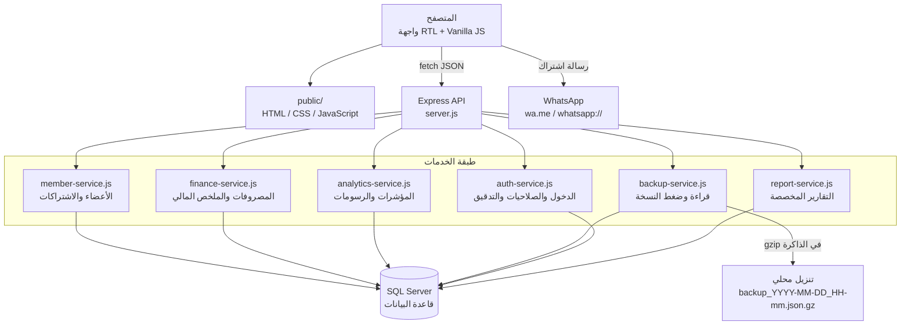
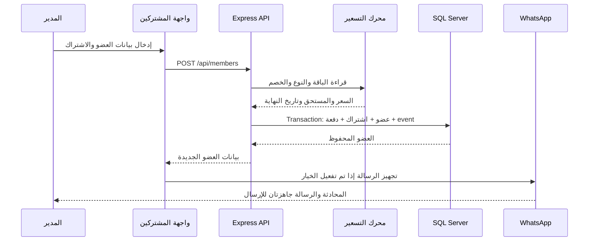
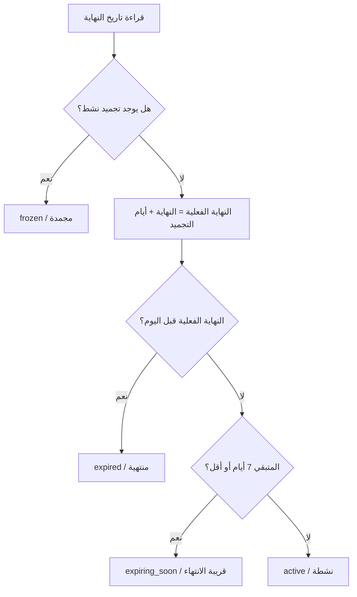

# TOP GYM — نظام إدارة عضويات الجيم

نظام ويب عربي متكامل لإدارة الجيم والاشتراكات والمدفوعات والمصروفات، مصمم ليعمل بسرعة على الكمبيوتر والموبايل من خلال واجهة RTL بسيطة وحديثة.

<p align="center">
  <a href="https://top-gym-managment.vercel.app">فتح النسخة المنشورة</a>
  ·
  <a href="https://github.com/AhmedSalem104/Top-Gym-Managment">مستودع GitHub</a>
</p>

> عند أول فتح للنسخة المنشورة ستظهر شاشة إعداد أولي لإنشاء حساب مدير. بعد ذلك يمكن للمدير إضافة حسابات استقبال وتحديد الصلاحيات من تبويب «الأسعار والعضويات».

## نظرة سريعة

يحتوي التطبيق على خمس مناطق رئيسية:

| المنطقة | ما الذي تقدمه؟ |
| --- | --- |
| لوحة التحكم | مؤشرات الأعضاء، التنبيهات اليومية، ملخص الشهر، والتحليلات الأسبوعية والشهرية والسنوية. |
| المشتركون | إضافة وتعديل وحذف الأعضاء، البحث، الفلترة، pagination، التفاصيل، الطباعة، التجميد، الاستئناف، التجديد، وتسجيل الدفعات. |
| المصروفات | إضافة وتعديل وحذف المصروفات، مع حساب إجمالي مصروفات الشهر وصافي الشهر تلقائيًا. |
| الأسعار والعضويات | إدارة الباقات، أنواع العضويات، مدد الاشتراك، معاملات الأسعار، الأسعار المستقلة لكل مدة، وحالة الظهور. |
| التقارير | تقرير مخصص بفترة زمنية، مؤشرات مالية، حركة يومية، توزيع الباقات وطرق الدفع، وقائمة قابلة للتصدير CSV. |

## المزايا الأساسية

- واجهة عربية RTL متجاوبة مع الكمبيوتر والموبايل.
- Pagination من السيرفر، والافتراضي 5 أعضاء في الصفحة، والحد الأعلى للطلب 50.
- بحث بالاسم أو الهاتف مع فلترة حسب حالة الاشتراك وترتيب حسب الأقرب انتهاءً أو الأحدث أو المبلغ المتبقي.
- حالات محسوبة تلقائيًا: نشطة، قريبة الانتهاء، منتهية، ومجمدة.
- حساب تاريخ النهاية من إعدادات نوع العضوية، مع إمكانية التعديل اليدوي للتاريخ.
- أسعار مستقلة لكل باقة ولكل مدة، بدل الاعتماد الإجباري على معامل واحد.
- خصم، مستحق، مدفوع، متبقي، وطريقة دفع مع إعادة الحساب من السيرفر داخل transaction.
- تجميد العضوية واستئنافها بحد أقصى 3 مرات لكل عضو.
- سجل عمليات كامل للإضافة والتعديل والتجديد والتجميد والاستئناف وتحديث الدفع.
- ملف مشترك كامل يعرض الاشتراكات، التجميدات، المدفوعات، والملاحظات وسجل العمليات.
- صلاحيات مدير واستقبال مع جلسة دخول، حسابات مستقلة، وتعطيل المستخدمين بدل حذف أثرهم.
- سجل تدقيق يوضح من أضاف أو عدّل أو حذف المشترك والمصروف والإعدادات ووقت العملية.
- منع تكرار رقم الهاتف أو البريد الإلكتروني مع توحيد صيغ أرقام الهاتف العربية والمصرية.
- إدارة مصروفات CRUD كاملة، وحساب صافي الشهر الحالي تلقائيًا.
- مؤشرات ورسومات للمدى الأسبوعي والشهري والسنوي.
- تقارير تشغيلية ومالية مخصصة مع تصدير CSV.
- زر تحميل نسخة احتياطية لحظية بصيغة `json.gz` بدون حفظ الملف على السيرفر.
- طباعة إيصال الاشتراك، صف من الجدول، أو ملف العضو الكامل بتنسيق TOP GYM.
- رسالة واتساب نصية احترافية بعد حفظ عضو جديد، مع دعم سطح المكتب والموبايل.
- معالجة متوافقة للاشتراكات القديمة التي تغير رمز نوعها، حتى لا يظهر الكود الداخلي للمستخدم.
- استعلامات SQL parameterized وفهارس للأجزاء الأكثر استخدامًا.

## المعمارية



### توزيع المسؤوليات

- `server.js`: تشغيل Express، تقديم الملفات الثابتة، تعريف مسارات API، ومعالجة الأخطاء.
- `src/member-service.js`: كل منطق العضوية والتسعير وحساب الحالات والتجميد والتجديد والمدفوعات.
- `src/finance-service.js`: CRUD المصروفات والملخص المالي للشهر الحالي.
- `src/analytics-service.js`: بناء النطاقات الزمنية، المؤشرات، التجميعات، ومصفوفات الرسم.
- `src/backup-service.js`: قراءة جداول التطبيق، إضافة ملف schema، ثم ضغط JSON إلى gzip.
- `src/auth-service.js`: الجلسات، كلمات المرور، الأدوار، الصلاحيات، المستخدمون وسجل التدقيق.
- `src/report-service.js`: التقارير المخصصة بالفترة الزمنية والتجميعات وقائمة المشتركين.
- `src/db.js`: الاتصال بـSQL Server وتهيئة schema عند تشغيل السيرفر محليًا.
- `public/index.html`: هيكل الصفحة والحوارات والتبويبات.
- `public/js/app.js`: منطق الصفحة الرئيسي والطلبات والتعامل مع بيانات الأعضاء والأسعار.
- ملفات JavaScript الإضافية: كل ملف مسؤول عن تحسين مستقل بدل وضع التطبيق كله في ملف واحد.

## دورة إضافة مشترك جديد



يتم الحساب من السيرفر حتى لو أرسلت الواجهة قيمة مختلفة في `amountDue`. السعر النهائي يعتمد على إعدادات قاعدة البيانات، والـtransaction تمنع حفظ عضو بدون الاشتراك أو الدفعة المرتبطة به.

## التبويبات وتجربة الاستخدام

### لوحة التحكم

- خمس بطاقات لحالات الأعضاء: الإجمالي، النشطة، القريبة من الانتهاء، المنتهية، والمجمدة.
- بطاقة متابعة اليوم للتنبيهات التي تحتاج إجراء سريع.
- بطاقة ملخص الشهر الحالي:
  - إجمالي الاشتراكات المدفوعة خلال الشهر.
  - إجمالي المصروفات.
  - صافي الشهر = الاشتراكات − المصروفات.
- قسم تحليلات يمكن تبديله بين أسبوعي وشهري وسنوي.
- مؤشر صحة عام، نسبة النشاط، حصة المصروفات، أكثر فترة حركة، وعدد التنبيهات.
- رسومات التحصيل والمصروفات وتوزيع الباقات والأنواع وطرق الدفع.

### المشتركون

- افتراضيًا يتم فتح التطبيق على تبويب المشتركين.
- زر إضافة عضو جديد يفتح dialog مستقل.
- يمكن تشغيل إرسال رسالة واتساب بعد نجاح الحفظ.
- قائمة الإجراءات في الجدول تجمع التفاصيل والتعديل والتجديد والتجميد والدفع والحذف.
- «التفاصيل» يحمّل ملف العضو عند الطلب فقط، ويعرض الاشتراكات والتجميدات وسجل العمليات.
- الطباعة متاحة للعضو أو للاشتراك الحالي أو للملف الكامل.

### المصروفات

كل مصروف يحتوي على:

| الحقل | الوصف |
| --- | --- |
| اسم المصروف | مثل إيجار، صيانة، أدوات أو كهرباء. |
| المبلغ | قيمة موجبة بالجنيه المصري. |
| التاريخ | تاريخ تسجيل المصروف أو تاريخ وقوعه. |
| الملاحظة | اختيارية حتى 500 حرف. |

بعد الإضافة أو التعديل أو الحذف يتم تحديث ملخص الشهر والقائمة تلقائيًا.

### الأسعار والعضويات

يوجد نوعان من الإعدادات:

1. **الباقات** مثل `gym_only` و`gym_cardio`: الاسم، السعر الشهري، الترتيب، وحالة الظهور.
2. **أنواع العضويات** مثل شهرية أو نصف شهر أو نوع مخصص: الاسم، رمز برمجي، وحدة المدة، قيمة المدة، معامل السعر، الترتيب، وحالة الظهور.

كما يدعم النظام جدول `membership_type_prices` لتحديد سعر مستقل لكل زوج:

```text
gym_only    + monthly    = 350 ج.م
gym_only    + half_month = 180 ج.م
gym_cardio  + monthly    = 400 ج.م
gym_cardio  + half_month = 200 ج.م
```

إذا لم يوجد سعر مستقل، يستخدم النظام السعر الشهري × معامل النوع كقيمة احتياطية.

## قواعد الحالات والتجميد



- النوع الذي يعمل بوحدة `days` يحسب النهاية بإضافة `durationValue - 1` يوم.
- النوع الذي يعمل بوحدة `months` يحسب النهاية بإضافة عدد الشهور ثم طرح يوم.
- كل تجميد يسجل بداية ونهاية وسببًا، ولا يحذف من التاريخ.
- الحد الأقصى للتجميد هو 3 مرات للعضو عبر سجلاته.
- قيمة `effectiveEndDate` تستخدم في الحالة والتنبيهات والعرض والطباعة.

## نموذج البيانات

```mermaid
erDiagram
    MEMBERS ||--o{ MEMBERSHIPS : owns
    MEMBERSHIPS ||--|| GYM_PAYMENTS : has
    MEMBERSHIPS ||--o{ MEMBERSHIP_FREEZES : contains
    MEMBERS ||--o{ MEMBERSHIP_EVENTS : records
    MEMBERSHIPS ||--o{ MEMBERSHIP_EVENTS : references
    MEMBERSHIP_PRICING ||--o{ MEMBERSHIP_TYPE_PRICES : prices
    MEMBERSHIP_TYPES ||--o{ MEMBERSHIP_TYPE_PRICES : priced_by

    MEMBERS {
        int id PK
        nvarchar full_name
        nvarchar phone
        nvarchar email
        date registration_date
        nvarchar notes
    }
    MEMBERSHIPS {
        int id PK
        int member_id FK
        varchar membership_plan
        varchar membership_type
        date start_date
        date end_date
        nvarchar notes
    }
    GYM_PAYMENTS {
        int id PK
        int membership_id FK UK
        decimal list_price
        decimal discount_amount
        decimal amount_due
        decimal amount_paid
        decimal amount_remaining
        varchar payment_method
        date paid_at
    }
    MEMBERSHIP_FREEZES {
        int id PK
        int membership_id FK
        date start_date
        date end_date
        date resumed_date
        nvarchar reason
    }
    MEMBERSHIP_EVENTS {
        int id PK
        int member_id FK
        int membership_id FK
        varchar event_type
        nvarchar details
    }
    MEMBERSHIP_PRICING {
        int id PK
        varchar plan_code UK
        nvarchar plan_name
        decimal monthly_price
        bit is_active
    }
    MEMBERSHIP_TYPES {
        int id PK
        varchar type_code UK
        nvarchar type_name
        varchar duration_mode
        decimal duration_value
        decimal price_multiplier
        bit is_active
    }
    MEMBERSHIP_TYPE_PRICES {
        varchar plan_code PK, FK
        varchar type_code PK, FK
        decimal price
    }
```

### الجداول التي يملكها التطبيق

- `members`: البيانات الأساسية للعضو.
- `memberships`: كل اشتراك أو تجديد كسجل مستقل.
- `membership_pricing`: الباقات وأسعارها الشهرية.
- `membership_types`: أنواع العضويات ومدتها ومعامل سعرها.
- `membership_type_prices`: سعر مستقل لكل باقة ونوع.
- `membership_freezes`: سجل التجميدات.
- `gym_payments`: مدفوعات الجيم، منفصل عن جدول `Payments` المشترك الموجود في قاعدة البيانات.
- `gym_expenses`: المصروفات.
- `membership_events`: السجل الزمني للعمليات.
- `gym_users`: حسابات المدير والاستقبال مع كلمة مرور مجزأة وحالة الحساب.
- `gym_audit_log`: أثر تدقيقي يثبت المستخدم والدور والعملية والوقت.

## النسخ الاحتياطي

زر **تحميل نسخة احتياطية** يستدعي:

```text
GET /api/backup/download
```

ثم ينفذ الآتي:


الملف الناتج يكون مثل:

```text
backup_2026-08-09_17-19.json.gz
```

النسخة تشمل جداول التطبيق فقط، ولا تلمس جدول `dbo.Payments` غير التابع للتطبيق. لا يتم الاحتفاظ بملف النسخة على السيرفر بعد اكتمال التنزيل.

> النسخة الحالية توفر backup عند الطلب. لا يوجد scheduler داخلي يحفظ نسخًا يومية تلقائيًا على السيرفر؛ يمكن جدولة استدعاء endpoint خارجيًا إذا كانت هناك حاجة لذلك.

## الطباعة وواتساب

### الطباعة

ملفات الطباعة:

- `public/js/print-enhancements.js`
- `public/css/print.css`

التصميم يضيف شعار `TOP GYM`، عنوان المستند، بيانات العضو، الاشتراك، الحساب، تاريخ الطباعة، وسطر إدارة الجيم. يمكن استخدام نافذة الطباعة في المتصفح للحفظ كـPDF أو الطباعة الفعلية.

### واتساب

عند إضافة عضو جديد وتفعيل خيار الإرسال:

1. يحفظ التطبيق العضو أولًا.
2. يبني رسالة عربية منظمة تحتوي على الباقة والمدة والتواريخ والملخص المالي.
3. يظهر المبلغ المتبقي فقط إذا كان أكبر من صفر.
4. يفتح `wa.me` على الكمبيوتر أو `whatsapp://` على الموبايل.
5. تبقى شاشة الإدارة كما هي، والرسالة تكون جاهزة داخل المحادثة.

واتساب لا يثبت تلقائيًا أن الرقم عليه حساب؛ فتح المحادثة ونجاح الإرسال يعتمدان على تطبيق واتساب والجهاز والرقم.

## بنية المشروع

```text
.
├── database/
│   └── schema.sql                    # إنشاء الجداول والفهارس وعمليات الترحيل
├── public/
│   ├── index.html                    # الصفحة الرئيسية والحوارات والتبويبات
│   ├── favicon.svg                   # شعار TOP GYM
│   ├── css/
│   │   ├── base.css                  # القواعد الأساسية والمكونات العامة
│   │   ├── dashboard.css             # لوحة التحكم والتجاوب والخلفية
│   │   └── print.css                 # قالب الطباعة
│   ├── js/
│   │   ├── app.js                    # المنطق الرئيسي للأعضاء والأسعار
│   │   ├── page-tabs.js              # التبويبات
│   │   ├── pagination.js             # pagination
│   │   ├── monthly-finance.js        # المصروفات والملخص المالي
│   │   ├── dashboard-analytics.js    # المؤشرات والرسومات
│   │   ├── backup-enhancements.js    # تنزيل النسخة الاحتياطية
│   │   ├── print-enhancements.js     # الطباعة وPDF من المتصفح
│   │   ├── whatsapp-enhancements.js  # الرسالة وفتح واتساب
│   │   ├── action-menu.js            # قائمة إجراءات الجدول
│   │   ├── details-enhancements.js   # تفاصيل العضو
│   │   ├── alerts-enhancements.js    # التنبيهات
│   │   ├── design-enhancements.js    # تحسينات الواجهة
│   │   └── button-loading.js         # حالات التحميل للأزرار
│   └── tailwind.css                  # ملف مولد من src/tailwind.css
├── scripts/
│   ├── smoke-test.js                 # اختبار تكاملي مع تنظيف بياناته
│   └── seed-performance-test-data.js # إنشاء بيانات اختبار أداء
├── src/
│   ├── db.js                         # اتصال SQL Server وتهيئة schema
│   ├── date-utils.js                 # التواريخ حسب المنطقة الزمنية
│   ├── member-service.js             # الأعضاء والاشتراكات والتسعير
│   ├── finance-service.js            # المصروفات والملخص المالي
│   ├── analytics-service.js          # التحليلات الزمنية
│   ├── backup-service.js             # النسخ المضغوطة
│   └── tailwind.css                  # مصدر Tailwind
├── server.js                         # Express server وAPI routes
├── package.json                      # scripts والاعتمادات
├── tailwind.config.js                # إعداد Tailwind
└── .env.example                      # نموذج متغيرات البيئة
```

## المتطلبات

- Node.js `18.18` أو أحدث.
- SQL Server متاح من الجهاز أو بيئة النشر.
- قاعدة بيانات يمكن للمستخدم المحدد في connection string القراءة والكتابة عليها.
- متصفح حديث يدعم `fetch` و`dialog` و`URL.createObjectURL`.

## التشغيل المحلي

### 1. تثبيت الاعتمادات

```powershell
cd C:\path\to\Top-Gym-Managment
npm install
```

### 2. إعداد متغيرات البيئة

```powershell
Copy-Item .env.example .env
```

ثم عدّل `.env`:

```dotenv
MSSQL_CONNECTION_STRING="Server=your-server; Database=your-database; User Id=your-user; Password=your-password; Encrypt=True; TrustServerCertificate=True; MultipleActiveResultSets=True"
PORT=3000
APP_TIMEZONE=Africa/Cairo
```

`src/db.js` يدعم `MSSQL_CONNECTION_STRING`، ويستخدم `DATABASE_URL` كبديل إذا لم يوجد المتغير الأول. لا ترفع `.env` إلى GitHub.

### 3. تشغيل التطبيق

```powershell
npm start
```

ثم افتح:

```text
http://localhost:3000
```

للتطوير مع إعادة تشغيل Node تلقائيًا:

```powershell
npm run dev
```

عند تشغيل `server.js` مباشرة يتم تنفيذ `database/schema.sql` تلقائيًا. في بيئة serverless أو Vercel يجب التأكد من تجهيز قاعدة البيانات وتشغيل schema مرة واحدة قبل استقبال الطلبات.

## أوامر المشروع

| الأمر | الاستخدام |
| --- | --- |
| `npm start` | تشغيل Express على المنفذ المحدد في `PORT`. |
| `npm run dev` | تشغيل Node مع watch أثناء التطوير. |
| `npm run build` | بناء CSS النهائي. |
| `npm run build:css` | إعادة توليد `public/tailwind.css`. |
| `node scripts/smoke-test.js` | اختبار تكاملي للـAPI على قاعدة الاختبار. |
| `npm run seed:performance -- --count=1000` | إنشاء 1000 عضو اختبار بحالات متنوعة. |

## اختبار الأداء والبيانات التجريبية

لإنشاء بيانات اختبار متنوعة:

```powershell
npm run seed:performance -- --count=1000
```

السكربت يوزع الأعضاء على:

- اشتراكات نشطة.
- اشتراكات قريبة الانتهاء.
- اشتراكات منتهية.
- اشتراكات مجمدة.
- أعضاء بدون اشتراك.
- طرق دفع وخصومات وملاحظات وتواريخ مختلفة.

كل السجلات تحمل الوسم `PERF_TEST_SEED`، والسكربت يرفض التكرار إذا وجد بيانات تحمل الوسم. استخدمه على قاعدة اختبار فقط. للحذف بعد الاختبار، راجع عدد السجلات أولًا ثم احذف الأعضاء التي تحمل الوسم؛ الحذف المتسلسل ينظف الاشتراكات والمدفوعات والتجميدات والأحداث التابعة لها.

## الاختبار والتحقق

فحوصات سريعة قبل commit:

```powershell
node --check server.js
node --check src\member-service.js
node --check src\analytics-service.js
node --check public\js\app.js
npm run build
git diff --check
```

اختبار التكامل يحتاج اتصال قاعدة بيانات:

```powershell
node scripts\smoke-test.js
```

الاختبار ينشئ خطة ونوعًا وعضوًا مؤقتًا، يختبر الإضافة والتعديل والتجميد والاستئناف والدفع والتجديد والتفاصيل، ثم يحاول تنظيف البيانات التي أنشأها.

## API

### النظام واللوحة

| الطريقة | المسار | الوظيفة |
| --- | --- | --- |
| `GET` | `/api/health` | التحقق من اتصال SQL Server. |
| `GET` | `/api/bootstrap` | تحميل أولي للأعضاء والـdashboard والأسعار وpagination. |
| `GET` | `/api/dashboard` | الإحصائيات والتنبيهات اليومية. |
| `GET` | `/api/dashboard-analytics?period=week\|month\|year` | مؤشرات ورسومات فترة محددة. |
| `GET` | `/api/monthly-finance` | ملخص الشهر والمصروفات الحالية. |
| `GET` | `/api/backup/download` | إنشاء وتنزيل backup مضغوط لحظيًا. |
| `GET` | `/api/reports?from=YYYY-MM-DD&to=YYYY-MM-DD` | تقرير مخصص بالمؤشرات والحركة وقائمة المشتركين. |

### الدخول والصلاحيات

| الطريقة | المسار | الوظيفة |
| --- | --- | --- |
| `GET` | `/api/auth/status` | معرفة حالة الجلسة وهل يلزم إعداد أول مدير. |
| `POST` | `/api/auth/setup` | إنشاء أول حساب مدير مرة واحدة. |
| `POST` | `/api/auth/login` | تسجيل الدخول وإنشاء جلسة HttpOnly. |
| `POST` | `/api/auth/logout` | إنهاء الجلسة. |
| `GET/POST` | `/api/auth/users` | عرض وإضافة مستخدمي الإدارة، للمدير فقط. |
| `PUT/DELETE` | `/api/auth/users/:id` | تعديل أو تعطيل مستخدم، للمدير فقط. |
| `GET` | `/api/audit-log` | عرض آخر العمليات، للمدير فقط. |

الأدوار المتاحة:

- **مدير:** كامل الصلاحيات، بما فيها الحذف، المصروفات، الأسعار، النسخ الاحتياطي، المستخدمون وسجل التدقيق.
- **استقبال:** قراءة البيانات وإضافة/تعديل المشتركين والتقارير، بدون حذف أو تعديل الأسعار أو المصروفات أو النسخ الاحتياطي.

### الأعضاء والاشتراكات

| الطريقة | المسار | الوظيفة |
| --- | --- | --- |
| `GET` | `/api/members?search=&status=&sort=&page=1&pageSize=5` | قائمة الأعضاء مع pagination. |
| `GET` | `/api/members/:id` | بيانات عضو واحد. |
| `GET` | `/api/members/:id/details` | الملف الكامل وسجل الاشتراكات والتجميد والأحداث. |
| `POST` | `/api/members` | إضافة عضو واشتراك ودفعة داخل transaction. |
| `PUT` | `/api/members/:id` | تعديل بيانات العضو والاشتراك والحساب. |
| `DELETE` | `/api/members/:id` | حذف العضو والسجلات التابعة حسب العلاقات. |
| `POST` | `/api/members/:id/freeze` | تجميد العضوية بعدد أيام وسبب. |
| `POST` | `/api/members/:id/resume` | استئناف تجميد نشط. |
| `POST` | `/api/members/:id/renew` | إضافة اشتراك تجديد جديد. |
| `POST` | `/api/memberships/:id/payments` | تحديث أو تسجيل دفعة. |

مثال إضافة عضو:

```json
{
  "fullName": "أحمد محمد",
  "phone": "01000000000",
  "registrationDate": "2026-08-09",
  "membershipType": "monthly",
  "membershipPlan": "gym_only",
  "startDate": "2026-08-09",
  "discountAmount": 0,
  "amountPaid": 350,
  "paymentMethod": "cash",
  "membershipNotes": "اشتراك جديد"
}
```

### الأسعار والعضويات

| الطريقة | المسار | الوظيفة |
| --- | --- | --- |
| `GET` | `/api/pricing` | الباقات والأنواع ومصفوفة الأسعار. |
| `PUT` | `/api/pricing` | حفظ عدة باقات وأسعار المدد في transaction. |
| `PUT` | `/api/pricing/:planCode` | تعديل باقة. |
| `POST` | `/api/pricing-plans` | إضافة باقة. |
| `PUT` | `/api/pricing-plans/:planCode` | تعديل باقة مع الاسم أو السعر أو الحالة. |
| `POST` | `/api/membership-types` | إضافة نوع مدة. |
| `PUT` | `/api/membership-types/:typeCode` | تعديل مدة أو معامل أو حالة نوع. |

### المصروفات

| الطريقة | المسار | الوظيفة |
| --- | --- | --- |
| `POST` | `/api/expenses` | إضافة مصروف. |
| `PUT` | `/api/expenses/:id` | تعديل مصروف. |
| `DELETE` | `/api/expenses/:id` | حذف مصروف. |

## الأداء والاعتمادية

- تحميل أولي واحد عبر `/api/bootstrap` لتقليل عدد الطلبات.
- pagination من قاعدة البيانات بدل تحميل كل الأعضاء إلى المتصفح.
- تحميل التفاصيل عند فتحها فقط.
- `Promise.all` للطلبات المستقلة في الملخص والتحليلات والنسخ الاحتياطي.
- فهارس على الهاتف، آخر اشتراك، التجميدات النشطة، الأحداث، المدفوعات، وتاريخ المصروف.
- transaction في عمليات الإضافة والتعديل والتجديد وتحديث التسعير.
- `amount_remaining` عمود persisted في SQL Server.
- منع التكرار في أزرار النسخ الاحتياطي وبعض العمليات أثناء التحميل.
- ضغط backup في الذاكرة وتنزيله مباشرة بدون ملفات مؤقتة على السيرفر.

## الأمان وحدود النسخة الحالية

- يستخدم السيرفر معاملات SQL parameters بدل تركيب قيم المستخدم داخل الاستعلامات.
- يحدد حجم JSON الوارد إلى `100kb`.
- لا يقرأ أو يعدل جدول `dbo.Payments` المشترك مع نظام آخر.
- يضع `Cache-Control: no-store` على ملف النسخة الاحتياطية.
- `.env` و`node_modules` وملفات Vercel المحلية مستبعدة من Git.
- جلسات دخول موقعة في Cookie من نوع HttpOnly وSameSite، مع كلمات مرور مجزأة باستخدام `scrypt`.
- حماية server-side لكل مسارات القراءة والكتابة حسب دور المدير أو الاستقبال.
- سجل تدقيق مستقل يثبت المستخدم والدور والعملية والوقت، مع تعطيل الحساب بدل حذف أثره.
- منع تكرار العضو على مستوى الخدمة عبر رقم الهاتف الموحد أو البريد الإلكتروني.
- لا يوجد scheduler داخلي للنسخ اليومية أو retention تلقائي.
- قبل النشر العام أضف rate limiting لمسارات الدخول، وطبّق حماية CSRF إذا توسعت الواجهة إلى نطاقات متعددة.

## النشر على Vercel

بعد ضبط متغيرات البيئة في مشروع Vercel:

```powershell
npx vercel login
npx vercel --prod --yes
```

المتغيرات المطلوبة:

```text
MSSQL_CONNECTION_STRING
APP_TIMEZONE
TOP_GYM_AUTH_SECRET (اختياري، يفضّل ضبطه بقيمة عشوائية طويلة)
```

بعد النشر، افتح الموقع وأنشئ أول حساب مدير من شاشة الإعداد. لا توجد كلمة مرور افتراضية محفوظة داخل المشروع. استخدم تبويب المستخدمين لإضافة حسابات الاستقبال وتعديل صلاحياتها.

يجب أن تكون قاعدة SQL Server متاحة من بيئة Vercel، وأن تكون الجداول مهيأة مسبقًا. بعد النشر اختبر:

```powershell
Invoke-RestMethod https://your-domain.example/api/health
```

النسخة الحالية المنشورة:

<https://top-gym-managment.vercel.app>

## Git workflow

```powershell
git status
git add -A
git commit -m "Document TOP GYM architecture and features"
git push origin main
```

لا تضف `.env` أو بيانات العملاء أو ملفات backup إلى المستودع.

## الترخيص

المستودع خاص حاليًا (`private: true` في `package.json`). أضف ملف ترخيص واضحًا قبل إعادة استخدام المشروع خارج نطاق TOP GYM.
