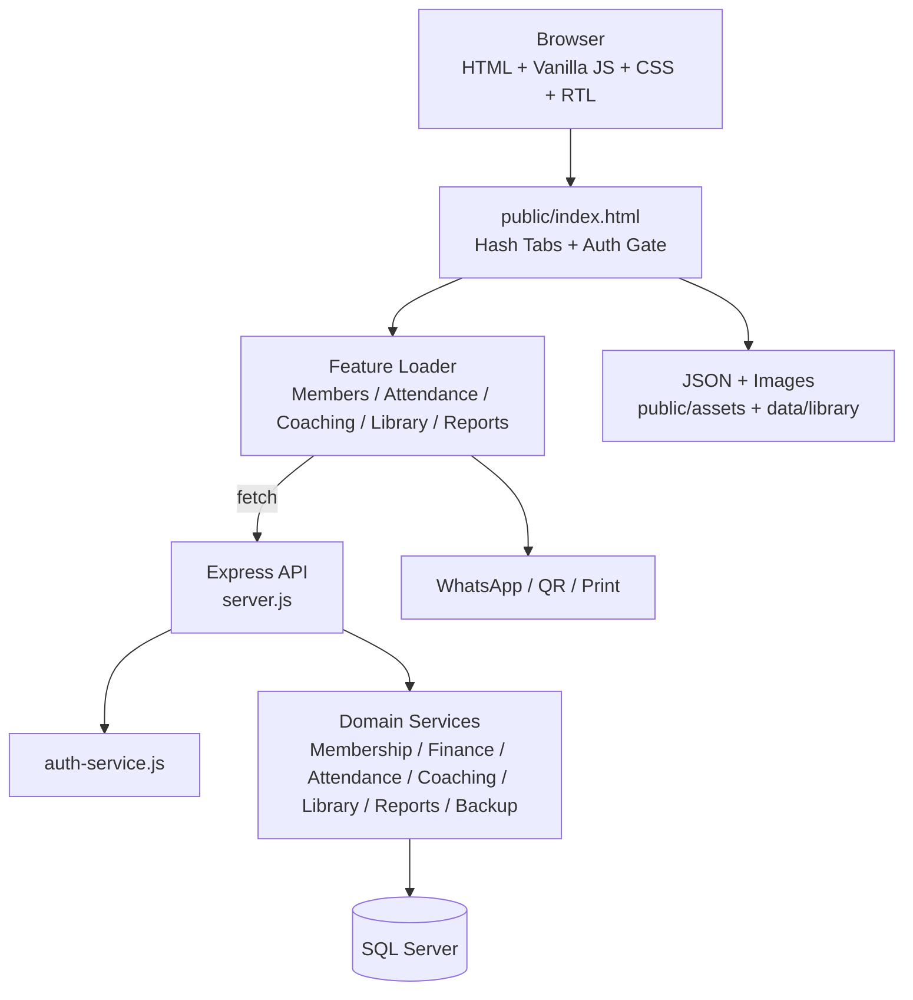

# TOP GYM

نظام إدارة جيم عربي بنظام RTL لإدارة المشتركين والاشتراكات والمدفوعات والحضور والتدريب والتغذية والمكتبة والتقارير والنسخ الاحتياطية.

- النسخة المنشورة: [top-gym-managment.vercel.app](https://top-gym-managment.vercel.app)
- المستودع: [AhmedSalem104/Top-Gym-Managment](https://github.com/AhmedSalem104/Top-Gym-Managment)
- آخر تحديث موثق: 2026-08-18

هذا الملف هو مرجع التشغيل والفهم الأول لأي Agent أو Developer. مصدر الحقيقة للتفاصيل الدقيقة للـDatabase والـAPI يظل الكود و[database/schema.sql](database/schema.sql) و[docs/TOP-GYM-TECHNICAL-SPECIFICATION.md](docs/TOP-GYM-TECHNICAL-SPECIFICATION.md).

## 1. الحالة الحالية باختصار

| المجال | الحالة الحالية |
|---|---|
| نوع التطبيق | Modular Monolith؛ واجهة Static SPA خفيفة مع Backend Express |
| Frontend | HTML + Vanilla JavaScript + CSS + Tailwind utilities |
| Backend | Node.js + Express |
| قاعدة البيانات | Microsoft SQL Server عبر `mssql` |
| اللغة والاتجاه | العربية، RTL، مع دعم LTR للأرقام والهاتف والبريد والتواريخ |
| Authentication | Session server-side داخل Cookie آمنة HttpOnly |
| الأدوار | `Owner` و`Assistant` |
| Pagination | Server-side؛ الافتراضي للمشتركين 5 عناصر والحد الأعلى 50 |
| المكتبة | 873 تمرينًا، 367 طعامًا، 297 عضلة في ملفات البيانات الحالية |
| الاختبارات | Smoke، QA Gate، Playwright E2E، وفحوصات بيانات المكتبة |

## 2. نطاق النظام

النظام مخصص لإدارة التشغيل اليومي للجيم، وليس تطبيقًا مستقلًا للعميل. لا يوجد Login للعميل في المرحلة الحالية.

الوظائف الرئيسية:

1. إدارة المشتركين والاشتراكات.
2. إدارة الأسعار وأنواع العضويات.
3. دفتر مالي وإيصالات دفع ومصروفات.
4. الحضور والانصراف بالهاتف أو QR Code.
5. إدارة المتدربين الخارجيين بدون اشتراك Gym.
6. إنشاء برامج التدريب وخطط التغذية وربطها بنفس ملف العميل.
7. مكتبة التمارين والأطعمة والعضلات.
8. التقارير والتحليلات.
9. النسخ الاحتياطية والتنزيل والاسترجاع.
10. طباعة الاشتراك والإيصالات والبرامج والملفات بصيغة Print/PDF.
11. رسائل WhatsApp يدوية؛ النظام يجهز الرسالة ويفتح المحادثة ولا يرسل تلقائيًا.

## 3. Architecture



### 3.1 Frontend

الواجهة الحالية ليست React أو Vue. هي Shell واحدة في `public/index.html` وتستخدم Hash Navigation مثل:

```text
/#dashboard
/#members
/#trainees
/#attendance
/#library
/#reports
```

المكونات الأساسية:

- `public/index.html`: الهيكل العام، Login، Header، التبويبات، الـDialogs، ومناطق الصفحات.
- `public/js/app.js`: منطق الصفحة الأساسي، المشتركين، الأسعار، الـDialogs، والحالات العامة.
- `public/js/auth-ui.js`: فحص الجلسة، Login، Logout، صلاحيات الواجهة، ومنع طلبات API قبل الجلسة.
- `public/js/page-tabs.js`: تفعيل التبويبات، تحديث Hash، إخفاء الأقسام، ومنع Style Flash أثناء تحميل الشاشة.
- `public/js/feature-loader.js`: تحميل CSS وJavaScript الخاص بالميزة عند الحاجة فقط.
- `public/js/monthly-finance.js`: ملخص الشهر والمصروفات.
- `public/js/attendance.js`: الحضور والانصراف والبحث وQR.
- `public/js/coaching.js`: المتدربون، برامج التدريب، خطط التغذية، القياسات، الجلسات، وسجل الوجبات.
- `public/js/library.js`: المكتبة والفلاتر والتفاصيل وCRUD.
- `public/js/reports.js`: التبويبات والتقارير والفلاتر والتصدير.
- `public/js/print-enhancements.js`: الطباعة وPDF وPrint Preview.
- `public/js/backup-enhancements.js`: التنزيل، الفحص، الاسترجاع، السجل، وحذف النسخ المحفوظة.

### 3.2 Backend

`server.js` هو Composition Root والـAPI Router الحالي. يستورد الخدمات من `src/` ويقوم بـ:

- تشغيل Express.
- تقديم الملفات الثابتة من `public/`.
- إضافة HTTP Security Headers.
- تطبيق JSON limit وRate Limit للعمليات الحساسة.
- تعريف Routes الحالية.
- تطبيق Authentication/Authorization Middleware.
- تهيئة قاعدة البيانات عند تشغيل الخادم.
- معالجة الأخطاء وإرجاع Responses JSON.

الخدمات الحالية:

| الملف | المسؤولية |
|---|---|
| `src/db.js` | اتصال SQL Server وتهيئة `database/schema.sql` |
| `src/auth-service.js` | المستخدمون، Hashing، Sessions، الأدوار، الصلاحيات |
| `src/member-service.js` | المشتركين، الاشتراكات، الأسعار، التجميد، التجديد، المدفوعات |
| `src/finance-service.js` | المصروفات والملخص المالي |
| `src/attendance-service.js` | Check-in، Check-out، سجل اليوم، التقارير |
| `src/coaching-service.js` | المتدربون، التدريب، التغذية، القياسات والجلسات |
| `src/library-service.js` | الأطعمة والتمارين والعضلات والتحميل من المكتبة |
| `src/analytics-service.js` | مؤشرات Dashboard والتحليلات الزمنية |
| `src/report-service.js` | التقارير المجمعة حسب الفترة |
| `src/backup-service.js` | إنشاء وفحص واسترجاع النسخ والاحتفاظ بالنسخ اليومية |
| `src/date-utils.js` | توحيد التواريخ والتوقيت |

### 3.3 قاعدة البيانات

`database/schema.sql` هو مصدر Schema الرئيسي، وتتم تهيئته بطريقة idempotent بحيث لا تُفقد الجداول الحالية عند إعادة التشغيل.

العلاقات الأساسية:

```text
members
 ├── memberships
 │    ├── membership_freezes
 │    ├── gym_payments
 │    └── gym_payment_transactions
 ├── gym_attendance
 ├── membership_events
 ├── workout_programs
 │    ├── workout_routines
 │    │    └── workout_exercises -> gym_exercises
 │    └── workout_sessions
 │         └── workout_set_logs
 ├── diet_plans
 │    └── diet_meals
 │         └── diet_meal_items -> gym_foods
 ├── body_measurements
 └── meal_logs
```

جداول التشغيل الرئيسية:

- `members`: هوية العميل الأساسية، الاسم، الهاتف، البريد، تاريخ التسجيل والملاحظات.
- `memberships`: الاشتراكات وتاريخ البداية والنهاية والخطة والنوع.
- `membership_pricing`: الباقات والأسعار الأساسية.
- `membership_types`: مدد الاشتراك ومعاملات السعر.
- `membership_type_prices`: أسعار كل باقة حسب نوع العضوية.
- `membership_freezes`: سجل التجميد والاستئناف.
- `gym_payments`: ملخص الدفع الحالي للاشتراك.
- `gym_payment_transactions`: دفتر مالي غير قابل للاستبدال منطقيًا لكل عملية دفع.
- `gym_expenses`: المصروفات.
- `gym_attendance`: الحضور والانصراف ووسيلة التسجيل.
- `membership_events`: سجل عمليات العضوية.
- `gym_muscles`, `gym_foods`, `gym_exercises`: كتالوج المكتبة.
- `workout_programs`, `workout_routines`, `workout_exercises`: برامج التدريب ومكوناتها.
- `diet_plans`, `diet_meals`, `diet_meal_items`: خطط التغذية والوجبات والأطعمة.
- `body_measurements`: القياسات والمتابعة.
- `workout_sessions`, `workout_set_logs`: تنفيذ جلسات التدريب وتسجيل المجموعات.
- `meal_logs`: تسجيل الوجبات التي تم تناولها.
- `gym_users`, `gym_auth_sessions`: حسابات الإدارة والجلسات.
- `gym_backup_operations`, `gym_backup_archives`: سجل النسخ والنسخ اليومية المحفوظة.

## 4. الشاشات والتبويبات

| Hash / Tab | المحتوى |
|---|---|
| `dashboard` | مؤشرات الأعضاء، الحالات، التنبيهات اليومية، ملخص الشهر، التحليلات والرسوم |
| `members` | CRUD للمشتركين، البحث، الفلترة، pagination، تفاصيل الملف، الدفع، التجديد، التجميد، QR والطباعة |
| `trainees` | المتدربون غير المشتركين الذين لديهم تدريب أو تغذية، ملف العميل، القياسات والأنظمة |
| `management` | الأسعار والعضويات، حسابات Assistant، النسخ الاحتياطية والاسترجاع |
| `attendance` | تسجيل الحضور والانصراف بالهاتف أو QR وسجل اليوم |
| `expenses` | CRUD للمصروفات وملخص الشهر الحالي |
| `library` | الأطعمة والتمارين والعضلات، البحث والفلاتر والتفاصيل وCRUD |
| `reports` | تقارير الحضور والعضويات والمالية والتدريب والمكتبة والنسخ الاحتياطية |

التبويب الافتراضي هو `dashboard` للمالك. يتم تحويل Assistant إلى `members` إذا طلب تبويبًا غير مسموح.

## 5. الصلاحيات والأدوار

### Owner

يمتلك صلاحية كاملة على جميع أجزاء النظام:

- جميع التبويبات الثمانية.
- إنشاء وتعديل وحذف المشتركين والاشتراكات.
- إدارة الأسعار والعضويات.
- إدارة المصروفات.
- إدارة المكتبة.
- إدارة التدريب والتغذية.
- التقارير والنسخ الاحتياطية والاسترجاع.
- إنشاء وتعديل وتعطيل وإعادة تفعيل حسابات Assistant.
- Reset Password للـAssistant من شاشة إدارة الحسابات.

### Assistant

يظهر له فقط:

- المشتركون.
- المتدرب الخارجي.
- الحضور والانصراف.
- المكتبة.

ويستطيع تنفيذ عمليات التشغيل الموجودة داخل هذه الشاشات حسب الـAPI، بما فيها عمليات التدريب المرتبطة بملف العميل.

لا يستطيع Assistant:

- رؤية Dashboard Analytics والملخصات المالية.
- إدارة الأسعار أو العضويات.
- إدارة المصروفات.
- فتح التقارير.
- إنشاء أو تعديل حسابات أخرى.
- تنزيل أو استرجاع النسخ الاحتياطية.

إخفاء التبويبات في الواجهة لتحسين UX فقط. مصدر الثقة هو Backend؛ كل API محمي يعيد `401` عند انتهاء الجلسة أو `403` عند عدم وجود الصلاحية.

## 6. Authentication والأمان

نموذج المستخدم في `dbo.gym_users`:

- `id`
- `full_name`
- `email`
- `email_normalized` مع Unique Index
- `password_hash`
- `role`: `Owner` أو `Assistant`
- `status`: المالك Active دائمًا، والـAssistant Active أو Disabled
- `last_login_at`, `created_at`, `updated_at`

الجلسات في `dbo.gym_auth_sessions`:

- Token عشوائي لا يُخزن كنص صريح؛ المخزن هو SHA-256 hash.
- Cookie باسم `topgym_session` مع `HttpOnly` و`SameSite=Lax`.
- انتهاء افتراضي بعد `AUTH_SESSION_DAYS=7`.
- Logout يلغي الجلسة من قاعدة البيانات.
- تعطيل Assistant أو Reset Password يلغي جلساته الحالية.
- Password Hashing باستخدام Node `crypto.scrypt` مع Salt عشوائي ومقارنة timing-safe.
- رسالة Login الخاطئ عامة ولا تكشف هل البريد موجود.
- Login Rate Limit حسب IP والبريد.

Bootstrap المالك الأول يتم من متغيرات الخادم فقط، ولا يتم إرسال كلمة المرور من أي API:

```env
AUTH_OWNER_EMAIL=owner@example.com
AUTH_OWNER_NAME=TOP GYM Owner
AUTH_OWNER_PASSWORD=<long-random-password>
AUTH_SESSION_DAYS=7
```

لا تُحفظ الأسرار في Git ولا يتم قراءتها أو طباعتها في تقارير Agents.

## 7. API Surface

### Authentication

```text
GET    /api/auth/session
POST   /api/auth/login
POST   /api/auth/logout
GET    /api/auth/users                 Owner
POST   /api/auth/users                 Owner
PUT    /api/auth/users/:id             Owner
PATCH  /api/auth/users/:id/status      Owner
```

### Members and Memberships

```text
GET    /api/members
GET    /api/members/:id
GET    /api/members/:id/details
POST   /api/members
PUT    /api/members/:id
DELETE /api/members/:id
POST   /api/members/:id/freeze
POST   /api/members/:id/resume
POST   /api/members/:id/renew
POST   /api/members/:id/memberships
POST   /api/memberships/:id/payments
```

### Pricing and Finance

```text
GET    /api/pricing
PUT    /api/pricing
PUT    /api/pricing/:planCode
POST   /api/pricing-plans
PUT    /api/pricing-plans/:planCode
POST   /api/membership-types
PUT    /api/membership-types/:typeCode
GET    /api/monthly-finance
POST   /api/expenses
PUT    /api/expenses/:id
DELETE /api/expenses/:id
```

### Attendance

```text
GET    /api/attendance
GET    /api/attendance/report
GET    /api/attendance/member/:id
POST   /api/attendance/check-in
POST   /api/attendance/check-out
```

### Coaching and Nutrition

الـAPI يدعم الاسمين القديم والجديد للحفاظ على Backward Compatibility:

```text
GET/POST/PUT/PATCH/DELETE /api/workoutprograms
GET/POST/PUT/PATCH/DELETE /api/workout-programs
GET/POST/PUT/PATCH/DELETE /api/dietplans
GET/POST/PUT/PATCH/DELETE /api/diet-plans

GET    /api/external-trainees
POST   /api/external-trainees
GET    /api/coaching/clients
GET    /api/clients/:id/training-overview
PUT    /api/clients/:id
GET/POST/PUT/DELETE /api/clients/:id/measurements
GET/POST/PUT/DELETE /api/clients/:id/checkins
POST   /api/workoutsessions/start
GET    /api/workoutsessions
GET    /api/workoutsessions/:id
POST   /api/workoutsessions/:id/sets
POST   /api/workoutsessions/:id/end
POST   /api/meal-logs
GET    /api/meal-logs
```

الاشتراك ليس شرطًا لإنشاء تدريب أو تغذية. `members` هو ملف العميل الواحد؛ يمكن للمتدرب الخارجي أن يملك أنظمة وقياسات بدون Membership، ثم تتم إضافة Membership لاحقًا لنفس `member_id` بدون تكرار العميل.

### Library and Reports

```text
GET    /api/library/options
GET    /api/library/:type
GET    /api/library/:type/:id
POST   /api/library/:type
PUT    /api/library/:type/:id
DELETE /api/library/:type/:id
GET    /api/reports
GET    /api/dashboard
GET    /api/dashboard-analytics?period=week|month|year
GET    /api/bootstrap
```

### Backup

```text
GET    /api/backup/download              json.gz افتراضيًا أو format=bak
GET    /api/backup/history
GET    /api/backup/archives/:id
DELETE /api/backup/archives/:id
POST   /api/backup/inspect
POST   /api/backup/restore
GET    /api/backup/daily                  Cron محمي
```

## 8. قواعد العمل المهمة

### Membership

- السعر النهائي يحسب على الخادم من الباقة والنوع والخصم.
- `amountDue = listPrice - discountAmount`.
- `amountRemaining = amountDue - amountPaid`.
- حالات الاشتراك: نشطة، قريبة الانتهاء، منتهية، مجمدة.
- الهاتف يتم تطبيعه لمنع تكرار نفس المشترك بصيغ مصرية مختلفة.
- التجميد محدود افتراضيًا بثلاث مرات للعضو.
- عمليات الإضافة والتجديد والدفع والتجميد تسجل في السجل المناسب.
- الدفع الجديد لا يستبدل دفتر المعاملات التاريخي.

### Attendance

- لا يسمح بتكرار حضور العضو في نفس اليوم قبل تسجيل الانصراف.
- يمكن تسجيل الدخول بالهاتف أو QR.
- زر الإجراء يتغير تلقائيًا إلى حضور أو انصراف حسب حالة العضو.
- الانصراف التلقائي الافتراضي بعد 60 دقيقة، قابل للتعديل عبر `ATTENDANCE_AUTO_CHECKOUT_MINUTES`.

### Training and Nutrition

- التدريب والتغذية مرتبطان بالعميل وليس بشرط وجود Membership.
- برنامج التدريب يتكون من Program ثم Routines ثم Exercises.
- خطة التغذية تتكون من Plan ثم Meals ثم Meal Items.
- قيم الأطعمة المحسوبة تعتمد على بيانات الطعام لكل 100 جرام/وحدة في المكتبة.
- الجلسات تسجل البداية والمجموعات والنهاية في قاعدة البيانات.
- الوجبات المسجلة تنشئ `meal_logs` فعليًا.
- الحفظ يجب أن يحافظ على العلاقات وعدم ترك بيانات ناقصة عند فشل العملية.

## 9. Design System وقرارات التصميم

المبادئ الحالية:

- واجهة عربية RTL مع `Cairo`.
- ألوان Light SaaS: خلفية أزرق-رمادي فاتح، أسطح بيضاء، Primary أزرق، وألوان الحالة فقط عند الحاجة.
- Cards وPanels بحدود خفيفة وRadius موحد وظلال بسيطة.
- Touch targets لا تقل تقريبًا عن 40–44px.
- Tables متجاوبة؛ يتم استخدام overflow محدود أو Card Layout على الموبايل حسب الشاشة.
- الأرقام والهاتف والبريد والتواريخ تستخدم LTR داخليًا عند الحاجة.
- حالات Loading وEmpty وError وSuccess واضحة.
- SweetAlert وDialogs في منتصف الشاشة مع أيقونات وSpinner منسقة.
- أزرار الطباعة وWhatsApp والإجراءات الخطرة لها ترتيب بصري واضح.
- Transitions قصيرة تقريبًا بين 150 و300ms، مع احترام `prefers-reduced-motion` حيثما يتم استخدام الحركة.

### CSS loading وStyle Flash

- `design-system.css` هو المصدر المركزي لقواعد Shell، Boot Gate، التنقل، القياسات المشتركة، Controls، Dialogs، والجداول المشتركة.
- `base.css` و`dashboard.css` يحتويان على تصميم الصفحة والـDashboard الحالي.
- CSS الخاص بالميزات مثل `attendance.css` و`coaching.css` و`library.css` و`operations.css` يتم تحميله Lazy بواسطة `feature-loader.js`.
- لا يتم إظهار التبويب قبل اكتمال تحميل CSS وJavaScript الخاصين به.
- أثناء فحص الجلسة أو تحميل التبويب يتم إخفاء الـShell لمنع ظهور تصميم أولي ثم تغييره.
- لا تتم إضافة `dark-theme.css` أو `ui-polish.css` من `index.html` حاليًا؛ لا تعتبرهما جزءًا من Runtime إلا إذا ظهر تحميل صريح لهما في الكود.

عند تعديل CSS: ابدأ بـ`design-system.css` للقواعد المشتركة، وقم بتقييد CSS الخاص بالميزة داخل نطاقها، ولا تضف Override عامًا أو `!important` إلا لسبب موثق.

## 10. المكتبة والAssets

مصادر البيانات الحالية:

```text
data/library/exercises.json  = 873 تمرينًا
data/library/foods.json      = 367 طعامًا
data/library/muscles.json    = 297 عضلة
```

صور التمارين:

- Manifest: `public/data/exercise-assets.json`.
- المصدر المعلن: `yuhonas/free-exercise-db`، revision موثق داخل الـManifest.
- الصيغة والأبعاد الأساسية: WebP، 720×480.
- الصورة الرئيسية تمثل وضع البداية، ويمكن استخدام صورة النهاية في التفاصيل والطباعة.
- لا تستخدم صورة من مصدر مختلف إذا لم يكن الـMatching مؤكدًا.
- الـManifest الحالي يسجل 873 تمرين Dataset، و265 تمرينًا كانت مرتبطة بالمشروع القديم؛ روابط المشروع القديمة تتضمن حالات تحتاج مراجعة، لذلك يجب الرجوع للـManifest قبل الادعاء بأن كل تمرين له صورة مؤكدة.

صور العضلات:

- Manifest: `public/data/muscle-assets.json`.
- المصدر: BodyParts3D / Anatomography.
- الترخيص المعلن: CC BY-SA 2.1 Japan.
- Style موحد: WebP، 320×420، خلفية فاتحة، العضلة المحددة بلون Highlight.
- إحصاء آخر Manifest: 297 سجلًا تمت مراجعتها، 214 Mapping ناجحًا، 188 تركيبًا تشريحيًا فريدًا، و83 حالة Manual Review.

لا تعدّل ملفات `data/` أو تنفذ Sync/Seed على قاعدة الإنتاج بدون طلب واضح وخطة تحقق.

## 11. الطباعة وWhatsApp

الطباعة تتم من خلال `public/js/print-enhancements.js` و`public/css/print.css`، وتشمل:

- اشتراك كامل.
- صف من جدول المشتركين.
- إيصال دفع.
- ملف العميل.
- برنامج تدريب أو خطة تغذية.
- قائمة الأسعار والباقات.
- ملف التدريب والتغذية الكامل.

قواعد الطباعة:

- تصميم A4 RTL.
- Header باسم وشعار TOP GYM.
- Footer إداري.
- تحميل بيانات التمرين والصورة قبل الطباعة عند الحاجة.
- Fallback موحد عند غياب الصورة.

WhatsApp يدوي فقط:

- النظام يبني رسالة Friendly بالعربية مع الاسم الكامل وتفاصيل الاشتراك.
- يفتح محادثة WhatsApp عبر الرابط المناسب.
- لا يتم الإرسال التلقائي ولا توجد WhatsApp API Server-side حاليًا.

## 12. النسخ الاحتياطية

النسخة اليدوية تجمع جداول النظام وتُنشأ لحظيًا ثم تُرسل للتنزيل بدون الاحتفاظ بها على السيرفر بعد انتهاء التنزيل:

- `json.gz`: نسخة JSON مضغوطة.
- `bak`: نسخة أرشيفية مضغوطة بنفس آلية النظام الحالية.
- الحد الأقصى لرفع ملف Restore هو 25MB.
- الحد الأقصى بعد فك الضغط 80MB.
- الحد الأقصى للصفوف 150,000.
- يتم التحقق من Schema والإصدار وSHA-256 عند توفر البصمة.
- Restore يحتاج Header تأكيد `X-TOP-GYM-RESTORE-CONFIRM: RESTORE`.
- أثناء Restore يوجد lock لمنع عمليتي استرجاع متزامنتين.

النسخة اليومية:

- المسار: `/api/backup/daily`.
- محمية بـ`CRON_SECRET` أو Vercel Cron.
- الاحتفاظ: يومان فقط (`DAILY_BACKUP_RETENTION_DAYS = 2`).
- الجدولة الحالية في `vercel.json`: `0 12 * * *` بتوقيت UTC. هذا يساوي 3 مساءً بتوقيت القاهرة خلال UTC+3؛ يجب مراجعة الجدولة عند تغير التوقيت المحلي.
- سجل العمليات والنسخ المحفوظة في `gym_backup_operations` و`gym_backup_archives`.

## 13. التشغيل محليًا

المتطلبات:

- Node.js `>=18.18`.
- SQL Server قابل للوصول من التطبيق.
- npm.

```powershell
npm install
Copy-Item .env.example .env
# عدّل MSSQL_CONNECTION_STRING والقيم السرية داخل .env محليًا فقط
npm run build
npm start
```

العناوين:

```text
http://localhost:3000
http://localhost:3000/api/health
```

أوامر التطوير:

```powershell
npm run dev
npm run build
npm run test:smoke
npm run test:e2e
npm run qa:gate
npm run qa:gate -- --build
npm run qa:gate:smoke
npm run qa:gate:browser
```

أوامر المكتبة:

```powershell
npm run qa:exercise-catalog
npm run qa:exercise-content
npm run qa:muscle-assets
npm run sync:library
```

لا تشغّل `sync:library` أو أي Restore على قاعدة إنتاج إلا بتفويض صريح ونسخة احتياطية مؤكدة.

## 14. الاختبارات وQA

قبل اعتبار أي تغيير مكتملًا:

1. شغّل `node --check` للملفات المتأثرة أو `npm run qa:gate`.
2. شغّل `npm run build`.
3. اختبر API المتأثر مع Owner وAssistant.
4. اختبر `401` للجلسة المنتهية و`403` للصفحات غير المسموحة.
5. اختبر Desktop وMobile على الأقل: 375، 390، 430، 768، 1024، 1440px.
6. افحص Console وNetwork وHorizontal Overflow.
7. اختبر الحالات Empty وLoading وError وSuccess.
8. عند تغيير الطباعة، راجع Print Preview/PDF.
9. عند تغيير قاعدة البيانات، راجع الـTransactions والـForeign Keys والـBackward Compatibility.

مرجع قواعد Agents:

- [qa/AGENT-CONTRACT.md](qa/AGENT-CONTRACT.md)
- [qa/AGENT-MATRIX.md](qa/AGENT-MATRIX.md)
- [qa/test-matrix.md](qa/test-matrix.md)

قواعد إلزامية:

- لا تقرأ أو تطبع أسرار `.env`.
- لا تنفذ حذفًا أو Restore أو Migration على الإنتاج بدون تفويض.
- لا تغيّر API أو Model أو Business Logic من مهمة UI فقط.
- لا تعتمد على بيانات Mock إذا كانت البيانات الحقيقية متاحة.
- سجّل الأدلة والنتيجة `PASS` أو `FAIL` أو `BLOCKED`.
- لا تعمل Commit أو Push إلا بطلب صريح.

## 15. قرارات التطوير المستقبلية

إعادة الهيكلة المفضلة هي Modular Monolith تدريجية، وليست إعادة كتابة كاملة:

```text
src/modules/<feature>/
  routes
  controller
  service
  repository
  validators

public/js/core/
public/js/features/<feature>/
public/css/core/
public/css/features/
```

الأولوية:

1. الحفاظ على API الحالي وعمل Contract Tests.
2. فصل Routes عن `server.js` تدريجيًا.
3. إنشاء API Client مركزي بدل طبقات `fetch` المتعددة.
4. إبقاء Design System مركزيًا وCSS الميزات Lazy.
5. إضافة Request deduplication وAbortController وDebounce.
6. الاعتماد على Server-side Pagination وفهارس قاعدة البيانات.
7. عدم الانتقال إلى React أو Microservices إلا بعد قياس حاجة حقيقية.

## 16. مراجع داخل المشروع

- [docs/AUTH.md](docs/AUTH.md): Authentication والأدوار والجلسات.
- [docs/TOP-GYM-TECHNICAL-SPECIFICATION.md](docs/TOP-GYM-TECHNICAL-SPECIFICATION.md): المواصفات التقنية التفصيلية.
- [docs/EXERCISE-ASSETS.md](docs/EXERCISE-ASSETS.md): صور التمارين ومصادرها.
- [docs/MUSCLE_ANATOMY_ASSETS.md](docs/MUSCLE_ANATOMY_ASSETS.md): صور العضلات وMapping والترخيص.
- [database/schema.sql](database/schema.sql): الجداول والعلاقات والقيود والفهارس.
- [package.json](package.json): الأوامر والاعتمادات.
- [vercel.json](vercel.json): Cron النسخ اليومية.

## 17. قاعدة التعامل مع التغييرات

قبل تعديل أي ملف، حدّد أولًا:

- هل التغيير UI فقط أم Business Logic؟
- ما الـAPI والـTables المتأثرة؟
- هل Owner وAssistant يتأثران بشكل مختلف؟
- هل يوجد تأثير على الطباعة أو QR أو WhatsApp أو Backup؟
- هل سيؤثر على Lazy Loading أو First Paint؟

بعد التعديل، يجب تحديث هذا README أو التوثيق المتخصص إذا تغيرت Architecture أو Permissions أو API أو قاعدة عمل أساسية.
