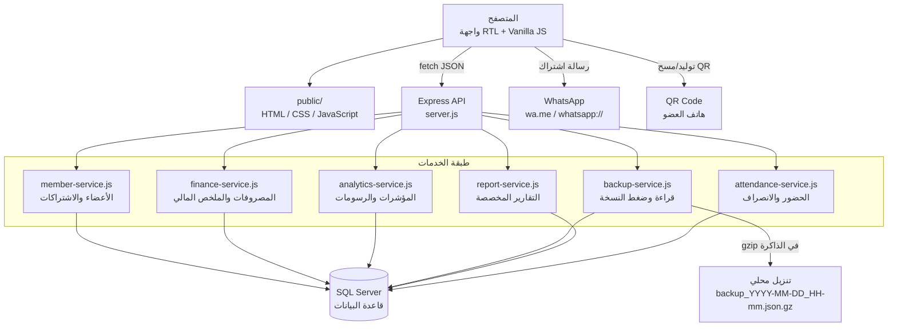
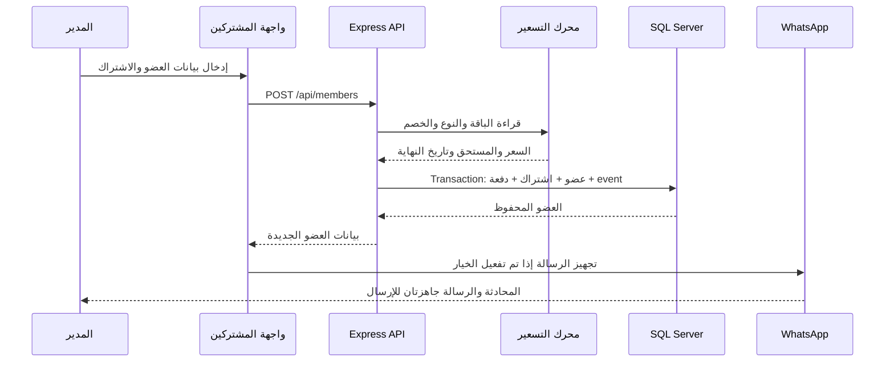
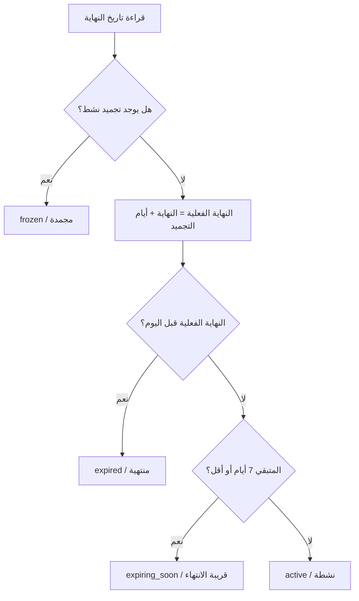

# TOP GYM — نظام إدارة عضويات الجيم

نظام ويب عربي متكامل لإدارة الجيم والاشتراكات والمدفوعات والمصروفات، مصمم ليعمل بسرعة على الكمبيوتر والموبايل من خلال واجهة RTL بسيطة وحديثة.

<p align="center">
  <a href="https://top-gym-managment.vercel.app">فتح النسخة المنشورة</a>
  ·
  <a href="https://github.com/AhmedSalem104/Top-Gym-Managment">مستودع GitHub</a>
</p>

## نظرة سريعة

يحتوي التطبيق على ست مناطق رئيسية:

| المنطقة | ما الذي تقدمه؟ |
| --- | --- |
| لوحة التحكم | مؤشرات الأعضاء، التنبيهات اليومية، ملخص الشهر، والتحليلات الأسبوعية والشهرية والسنوية. |
| المشتركون | إضافة وتعديل وحذف الأعضاء، البحث، الفلترة، pagination، التفاصيل، الطباعة، التجميد، الاستئناف، التجديد، وتسجيل الدفعات. |
| الحضور والانصراف | تسجيل الحضور والانصراف برقم الهاتف أو QR Code، منع التكرار اليومي، وسجل اليوم مع مدة التواجد. |
| المصروفات | إضافة وتعديل وحذف المصروفات، مع حساب إجمالي مصروفات الشهر وصافي الشهر تلقائيًا. |
| الأسعار والعضويات | إدارة الباقات، أنواع العضويات، مدد الاشتراك، معاملات الأسعار، الأسعار المستقلة لكل مدة، وحالة الظهور. |
| التقارير | تقرير مخصص بفترة زمنية، مؤشرات مالية، حركة يومية، توزيع الباقات وطرق الدفع، وقائمة قابلة للتصدير CSV. |

## المزايا الأساسية

- واجهة عربية RTL متجاوبة مع الكمبيوتر والموبايل.
- Pagination من السيرفر، والافتراضي 5 أعضاء في الصفحة، والحد الأعلى للطلب 50.
- بحث بالاسم أو الهاتف مع فلترة حسب حالة الاشتراك وترتيب حسب الأقرب انتهاءً أو الأحدث أو المبلغ المتبقي.
- حالات محسوبة تلقائيًا: نشطة، قريبة الانتهاء، منتهية، ومجمدة.
- حساب تاريخ النهاية من إعدادات نوع العضوية، مع إمكانية التعديل اليدوي للتاريخ.
- أسعار مستقلة لكل باقة ولكل مدة، بدل الاعتماد الإجباري على معامل واحد.
- خصم، مستحق، مدفوع، متبقي، وطريقة دفع مع إعادة الحساب من السيرفر داخل transaction.
- تجميد العضوية واستئنافها بحد أقصى 3 مرات لكل عضو.
- سجل عمليات العضوية كامل للإضافة والتعديل والتجديد والتجميد والاستئناف وتحديث الدفع.
- سجل مالي غير قابل للاستبدال لكل عضو: كل دفعة لها رقم إيصال وتاريخ ووقت وطريقة دفع وقيمة ورصيد متبقٍ.
- إيصال دفع مستقل قابل للطباعة، مع تضمين السجل المالي في ملف العضو الكامل.
- ملف مشترك كامل يعرض الاشتراكات، التجميدات، الإيصالات، والملاحظات وسجل العمليات.
- منع تكرار رقم الهاتف أو البريد الإلكتروني مع توحيد صيغ أرقام الهاتف العربية والمصرية، وعرض اسم المشترك الحالي في SweetAlert مركزي.
- حضور وانصراف بالهاتف أو QR Code، مع زر سريع داخل جدول المشتركين يتزامن مع شاشة الحضور.
- إنشاء QR تلقائيًا عند إضافة عضو جديد، وزر QR ظاهر للأعضاء الحاليين، مع منع التكرار اليومي.
- إغلاق تلقائي للسجلات المفتوحة بعد 60 دقيقة افتراضيًا، مع وسم «تلقائي» وإمكانية تغيير المدة عبر `ATTENDANCE_AUTO_CHECKOUT_MINUTES`.
- إدارة مصروفات CRUD كاملة، وحساب صافي الشهر الحالي تلقائيًا.
- مؤشرات ورسومات للمدى الأسبوعي والشهري والسنوي.
- تقارير تشغيلية ومالية مخصصة مع تصدير CSV.
- زر تحميل نسخة احتياطية لحظية بصيغة `json.gz` بدون حفظ الملف على السيرفر.
- بصمة سلامة SHA-256 داخل النسخ الجديدة، مع رفض النسخة إذا تم تعديل محتواها أو تلفه.
- طباعة إيصال الاشتراك، صف من الجدول، أو ملف العضو الكامل بتنسيق TOP GYM.
- طباعة إيصال دفع منفصل برقم `TG-000001` وتاريخ العملية وقيمة الدفعة والرصيد.
- رسالة واتساب نصية احترافية بعد حفظ عضو جديد، مع دعم سطح المكتب والموبايل.
- معالجة متوافقة للاشتراكات القديمة التي تغير رمز نوعها، حتى لا يظهر الكود الداخلي للمستخدم.
- استعلامات SQL parameterized وفهارس للأجزاء الأكثر استخدامًا.

## المعمارية



### توزيع المسؤوليات

- `server.js`: تشغيل Express، تقديم الملفات الثابتة، تعريف مسارات API، ومعالجة الأخطاء.
- `src/member-service.js`: كل منطق العضوية والتسعير وحساب الحالات والتجميد والتجديد والمدفوعات والسجل المالي.
- `src/attendance-service.js`: التحقق من العضوية وتسجيل الحضور والانصراف وسجل اليوم.
- `src/finance-service.js`: CRUD المصروفات والملخص المالي للشهر الحالي.
- `src/analytics-service.js`: بناء النطاقات الزمنية، المؤشرات، التجميعات، ومصفوفات الرسم.
- `src/backup-service.js`: قراءة جداول التطبيق، إضافة ملف schema، ثم ضغط JSON إلى gzip.
- `src/report-service.js`: التقارير المخصصة بالفترة الزمنية والتجميعات وقائمة المشتركين.
- `src/db.js`: الاتصال بـSQL Server وتهيئة schema عند تشغيل السيرفر محليًا.
- `public/index.html`: هيكل الصفحة والحوارات والتبويبات.
- `public/js/app.js`: منطق الصفحة الرئيسي والطلبات والتعامل مع بيانات الأعضاء والأسعار.
- `public/js/attendance.js`: واجهة الحضور، مسح QR، توليد QR، وسجل اليوم.
- ملفات JavaScript الإضافية: كل ملف مسؤول عن تحسين مستقل بدل وضع التطبيق كله في ملف واحد.

## دورة إضافة مشترك جديد



يتم الحساب من السيرفر حتى لو أرسلت الواجهة قيمة مختلفة في `amountDue`. السعر النهائي يعتمد على إعدادات قاعدة البيانات، والـtransaction تمنع حفظ عضو بدون الاشتراك أو الدفعة المرتبطة به.

## التبويبات وتجربة الاستخدام

### لوحة التحكم

- خمس بطاقات لحالات الأعضاء: الإجمالي، النشطة، القريبة من الانتهاء، المنتهية، والمجمدة.
- بطاقة متابعة اليوم للتنبيهات التي تحتاج إجراء سريع.
- بطاقة ملخص الشهر الحالي:
  - إجمالي الاشتراكات المدفوعة خلال الشهر.
  - إجمالي المصروفات.
  - صافي الشهر = الاشتراكات − المصروفات.
- قسم تحليلات يمكن تبديله بين أسبوعي وشهري وسنوي.
- مؤشر صحة عام، نسبة النشاط، حصة المصروفات، أكثر فترة حركة، وعدد التنبيهات.
- رسومات التحصيل والمصروفات وتوزيع الباقات والأنواع وطرق الدفع.

### المشتركون

- افتراضيًا يتم فتح التطبيق على تبويب المشتركين.
- زر إضافة عضو جديد يفتح dialog مستقل.
- يمكن تشغيل إرسال رسالة واتساب بعد نجاح الحفظ.
- قائمة الإجراءات في الجدول تجمع التفاصيل والتعديل والتجديد والتجميد والدفع والحذف.
- «التفاصيل» يحمّل ملف العضو عند الطلب فقط، ويعرض الاشتراكات والتجميدات وسجل العمليات.
- السجل المالي يعرض رقم الإيصال والتاريخ والوقت وقيمة كل دفعة وطريقة الدفع والمتبقي، مع زر طباعة الإيصال.
- الطباعة متاحة للعضو أو للاشتراك الحالي أو للملف الكامل.

### الحضور والانصراف

- افتح تبويب **الحضور والانصراف**، ثم اكتب رقم العضو واضغط «تسجيل حضور» أو «تسجيل انصراف».
- من جدول المشتركين استخدم زر «حضور» أو «انصراف» مباشرة، أو افتح زر QR الظاهر بجانب العضو.
- بعد إضافة عضو جديد يظهر QR الخاص به تلقائيًا، ويمكن تحميله أو طباعته، بينما QR الأعضاء الحاليين يُنشأ عند فتح زر QR.
- زر «مسح QR Code» يفتح كاميرا الهاتف عبر HTTPS، وبعد نجاح القراءة يسجل الحضور تلقائيًا.
- يمنع النظام تسجيل حضور ثانٍ لنفس العضو في نفس التاريخ، ولا يسمح بالحضور لعضوية منتهية أو مجمدة.
- عند غياب الانصراف، تغلق الخدمة السجل تلقائيًا بعد المدة المحددة وتحتفظ بوقت الانصراف الأصلي ومصدر العملية.

### المصروفات

كل مصروف يحتوي على:

| الحقل | الوصف |
| --- | --- |
| اسم المصروف | مثل إيجار، صيانة، أدوات أو كهرباء. |
| المبلغ | قيمة موجبة بالجنيه المصري. |
| التاريخ | تاريخ تسجيل المصروف أو تاريخ وقوعه. |
| الملاحظة | اختيارية حتى 500 حرف. |

بعد الإضافة أو التعديل أو الحذف يتم تحديث ملخص الشهر والقائمة تلقائيًا.

### الأسعار والعضويات

يوجد نوعان من الإعدادات:

1. **الباقات** مثل `gym_only` و`gym_cardio`: الاسم، السعر الشهري، الترتيب، وحالة الظهور.
2. **أنواع العضويات** مثل شهرية أو نصف شهر أو نوع مخصص: الاسم، رمز برمجي، وحدة المدة، قيمة المدة، معامل السعر، الترتيب، وحالة الظهور.

كما يدعم النظام جدول `membership_type_prices` لتحديد سعر مستقل لكل زوج:

```text
gym_only    + monthly    = 350 ج.م
gym_only    + half_month = 180 ج.م
gym_cardio  + monthly    = 400 ج.م
gym_cardio  + half_month = 200 ج.م
```

إذا لم يوجد سعر مستقل، يستخدم النظام السعر الشهري × معامل النوع كقيمة احتياطية.

## قواعد الحالات والتجميد



- النوع الذي يعمل بوحدة `days` يحسب النهاية بإضافة `durationValue - 1` يوم.
- النوع الذي يعمل بوحدة `months` يحسب النهاية بإضافة عدد الشهور ثم طرح يوم.
- كل تجميد يسجل بداية ونهاية وسببًا، ولا يحذف من التاريخ.
- الحد الأقصى للتجميد هو 3 مرات للعضو عبر سجلاته.
- قيمة `effectiveEndDate` تستخدم في الحالة والتنبيهات والعرض والطباعة.

## نموذج البيانات

```mermaid
erDiagram
    MEMBERS ||--o{ MEMBERSHIPS : owns
    MEMBERSHIPS ||--|| GYM_PAYMENTS : has
    MEMBERSHIPS ||--o{ MEMBERSHIP_FREEZES : contains
    MEMBERS ||--o{ MEMBERSHIP_EVENTS : records
    MEMBERSHIPS ||--o{ MEMBERSHIP_EVENTS : references
    MEMBERSHIPS ||--o{ GYM_PAYMENT_TRANSACTIONS : has
    MEMBERS ||--o{ GYM_ATTENDANCE : records
    MEMBERSHIP_PRICING ||--o{ MEMBERSHIP_TYPE_PRICES : prices
    MEMBERSHIP_TYPES ||--o{ MEMBERSHIP_TYPE_PRICES : priced_by

    MEMBERS {
        int id PK
        nvarchar full_name
        nvarchar phone
        nvarchar email
        date registration_date
        nvarchar notes
    }
    MEMBERSHIPS {
        int id PK
        int member_id FK
        varchar membership_plan
        varchar membership_type
        date start_date
        date end_date
        nvarchar notes
    }
    GYM_PAYMENTS {
        int id PK
        int membership_id FK UK
        decimal list_price
        decimal discount_amount
        decimal amount_due
        decimal amount_paid
        decimal amount_remaining
        varchar payment_method
        date paid_at
    }
    GYM_PAYMENT_TRANSACTIONS {
        int id PK
        int membership_id
        varchar transaction_type
        decimal amount_paid
        decimal amount_remaining
        varchar payment_method
        datetime2 created_at
    }
    GYM_ATTENDANCE {
        int id PK
        int member_id FK
        int membership_id
        date attendance_date UK
        datetime2 check_in_at
        datetime2 check_out_at
        varchar check_in_source
    }
    MEMBERSHIP_FREEZES {
        int id PK
        int membership_id FK
        date start_date
        date end_date
        date resumed_date
        nvarchar reason
    }
    MEMBERSHIP_EVENTS {
        int id PK
        int member_id FK
        int membership_id FK
        varchar event_type
        nvarchar details
    }
    MEMBERSHIP_PRICING {
        int id PK
        varchar plan_code UK
        nvarchar plan_name
        decimal monthly_price
        bit is_active
    }
    MEMBERSHIP_TYPES {
        int id PK
        varchar type_code UK
        nvarchar type_name
        varchar duration_mode
        decimal duration_value
        decimal price_multiplier
        bit is_active
    }
    MEMBERSHIP_TYPE_PRICES {
        varchar plan_code PK, FK
        varchar type_code PK, FK
        decimal price
    }
```

### الجداول التي يملكها التطبيق

- `members`: البيانات الأساسية للعضو.
- `memberships`: كل اشتراك أو تجديد كسجل مستقل.
- `membership_pricing`: الباقات وأسعارها الشهرية.
- `membership_types`: أنواع العضويات ومدتها ومعامل سعرها.
- `membership_type_prices`: سعر مستقل لكل باقة ونوع.
- `membership_freezes`: سجل التجميدات.
- `gym_payments`: مدفوعات الجيم، منفصل عن جدول `Payments` المشترك الموجود في قاعدة البيانات.
- `gym_payment_transactions`: سجل مالي append-only للإيصالات والدفعات والتسويات، مع ترحيل آمن للمدفوعات القديمة.
- `gym_expenses`: المصروفات.
- `gym_attendance`: حضور وانصراف العضو، مع قيد عضو واحد يوميًا.
- `membership_events`: السجل الزمني للعمليات.

## النسخ الاحتياطي

زر **تحميل نسخة احتياطية** يستدعي:

```text
GET /api/backup/download
```

إدارة الاسترجاع متاحة من تبويب **الأسعار والعضويات**:

```text
GET  /api/backup/history
POST /api/backup/inspect
POST /api/backup/restore
```

يرسل `inspect` الملف المضغوط للتحقق من نوعه، JSON، الجداول وعدد الصفوف وبصمة SHA-256 قبل أي تغيير. ولا يقبل `restore` التنفيذ إلا مع رأس الطلب:
`X-TOP-GYM-RESTORE-CONFIRM: RESTORE`. يتم الاسترجاع داخل transaction واحدة، وتُحفظ نتيجة التنزيل والفحص والاسترجاع في `gym_backup_operations`. النسخ القديمة التي لا تحتوي على بصمة تظل مدعومة بعد فحص بنيتها، بينما النسخ الجديدة ترفض إذا تغير محتواها. النسخ اليدوية تُنزّل مباشرة، بينما النسخة اليومية المجدولة تُحفظ مؤقتًا داخل `gym_backup_archives` لمدة يومين فقط.

ثم ينفذ الآتي:


الملف الناتج يكون مثل:

```text
backup_2026-08-09_17-19.json.gz
```

النسخ اليومية التلقائية:

- يطلب Vercel المسار `GET /api/backup/daily` يوميًا من خلال `vercel.json`، ويتم إنشاء نسخة محمولة بصيغة `.bak` وحفظها داخل جدول `gym_backup_archives` لمدة يومين فقط.
- سجل النسخ يظهر مباشرة أسفل لوحة النسخ الاحتياطية، ويمكن تحميل أي نسخة محفوظة من خلال `GET /api/backup/archives/:id`.
- الجدولة الموجودة `0 12 * * *` تعادل الساعة 3 مساءً بتوقيت القاهرة حاليًا؛ Vercel Cron يستخدم UTC وقد يتأخر التنفيذ على خطة Hobby ضمن نافذة الدقة المسموحة.
- يفضل ضبط `CRON_SECRET` في Vercel، وسيتم قبول الطلب المجدول فقط مع `Authorization: Bearer <CRON_SECRET>` عند ضبطه.

النسخة تشمل جداول التطبيق فقط، ولا تلمس جدول `dbo.Payments` غير التابع للتطبيق. النسخ اليدوية لا تترك ملفًا على السيرفر بعد التنزيل، أما النسخة اليومية فتُحفظ داخل قاعدة البيانات لمدة يومين حسب سياسة الاحتفاظ.

> النسخة الحالية توفر backup عند الطلب، كما تحفظ النسخة اليومية التلقائية داخل قاعدة البيانات لمدة يومين فقط، مع تنظيف النسخ الأقدم أثناء التشغيل التالي.

## الطباعة وواتساب

### الطباعة

ملفات الطباعة:

- `public/js/print-enhancements.js`
- `public/css/print.css`

التصميم يضيف شعار `TOP GYM`، عنوان المستند، بيانات العضو، الاشتراك، الحساب، تاريخ الطباعة، وسطر إدارة الجيم. يمكن استخدام نافذة الطباعة في المتصفح للحفظ كـPDF أو الطباعة الفعلية.

### واتساب

عند إضافة عضو جديد وتفعيل خيار الإرسال:

1. يحفظ التطبيق العضو أولًا.
2. يبني رسالة عربية منظمة تحتوي على الباقة والمدة والتواريخ والملخص المالي.
3. يظهر المبلغ المتبقي فقط إذا كان أكبر من صفر.
4. يفتح `wa.me` على الكمبيوتر أو `whatsapp://` على الموبايل.
5. تبقى شاشة الإدارة كما هي، والرسالة تكون جاهزة داخل المحادثة.

واتساب لا يثبت تلقائيًا أن الرقم عليه حساب؛ فتح المحادثة ونجاح الإرسال يعتمدان على تطبيق واتساب والجهاز والرقم.

## بنية المشروع

```text
.
├── database/
│   └── schema.sql                    # إنشاء الجداول والفهارس وعمليات الترحيل
├── public/
│   ├── index.html                    # الصفحة الرئيسية والحوارات والتبويبات
│   ├── favicon.svg                   # شعار TOP GYM
│   ├── css/
│   │   ├── base.css                  # القواعد الأساسية والمكونات العامة
│   │   ├── dashboard.css             # لوحة التحكم والتجاوب والخلفية
│   │   ├── print.css                 # قالب الطباعة
│   │   └── attendance.css            # واجهة الحضور والانصراف
│   ├── js/
│   │   ├── app.js                    # المنطق الرئيسي للأعضاء والأسعار
│   │   ├── attendance.js              # الهاتف وQR وسجل الحضور
│   │   ├── page-tabs.js              # التبويبات
│   │   ├── pagination.js             # pagination
│   │   ├── monthly-finance.js        # المصروفات والملخص المالي
│   │   ├── dashboard-analytics.js    # المؤشرات والرسومات
│   │   ├── backup-enhancements.js    # تنزيل النسخة الاحتياطية
│   │   ├── print-enhancements.js     # الطباعة وPDF من المتصفح
│   │   ├── whatsapp-enhancements.js  # الرسالة وفتح واتساب
│   │   ├── action-menu.js            # قائمة إجراءات الجدول
│   │   ├── details-enhancements.js   # تفاصيل العضو
│   │   ├── alerts-enhancements.js    # التنبيهات
│   │   ├── design-enhancements.js    # تحسينات الواجهة
│   │   └── button-loading.js         # حالات التحميل للأزرار
│   └── tailwind.css                  # ملف مولد من src/tailwind.css
├── scripts/
│   ├── smoke-test.js                 # اختبار تكاملي مع تنظيف بياناته
│   └── seed-performance-test-data.js # إنشاء بيانات اختبار أداء
├── src/
│   ├── db.js                         # اتصال SQL Server وتهيئة schema
│   ├── date-utils.js                 # التواريخ حسب المنطقة الزمنية
│   ├── member-service.js             # الأعضاء والاشتراكات والتسعير
│   ├── attendance-service.js         # الحضور والانصراف
│   ├── finance-service.js            # المصروفات والملخص المالي
│   ├── analytics-service.js          # التحليلات الزمنية
│   ├── backup-service.js             # النسخ المضغوطة
│   └── tailwind.css                  # مصدر Tailwind
├── server.js                         # Express server وAPI routes
├── package.json                      # scripts والاعتمادات
├── tailwind.config.js                # إعداد Tailwind
└── .env.example                      # نموذج متغيرات البيئة
```

## المتطلبات

- Node.js `18.18` أو أحدث.
- SQL Server متاح من الجهاز أو بيئة النشر.
- قاعدة بيانات يمكن للمستخدم المحدد في connection string القراءة والكتابة عليها.
- متصفح حديث يدعم `fetch` و`dialog` و`URL.createObjectURL`.

## التشغيل المحلي

### 1. تثبيت الاعتمادات

```powershell
cd C:\path\to\Top-Gym-Managment
npm install
```

### 2. إعداد متغيرات البيئة

```powershell
Copy-Item .env.example .env
```

ثم عدّل `.env`:

```dotenv
MSSQL_CONNECTION_STRING="Server=your-server; Database=your-database; User Id=your-user; Password=your-password; Encrypt=True; TrustServerCertificate=True; MultipleActiveResultSets=True"
PORT=3000
APP_TIMEZONE=Africa/Cairo
ATTENDANCE_AUTO_CHECKOUT_MINUTES=60
```

`src/db.js` يدعم `MSSQL_CONNECTION_STRING`، ويستخدم `DATABASE_URL` كبديل إذا لم يوجد المتغير الأول. لا ترفع `.env` إلى GitHub.

### 3. تشغيل التطبيق

```powershell
npm start
```

ثم افتح:

```text
http://localhost:3000
```

للتطوير مع إعادة تشغيل Node تلقائيًا:

```powershell
npm run dev
```

عند تشغيل `server.js` مباشرة يتم تنفيذ `database/schema.sql` تلقائيًا. في بيئة serverless أو Vercel يجب التأكد من تجهيز قاعدة البيانات وتشغيل schema مرة واحدة قبل استقبال الطلبات.

## أوامر المشروع

| الأمر | الاستخدام |
| --- | --- |
| `npm start` | تشغيل Express على المنفذ المحدد في `PORT`. |
| `npm run dev` | تشغيل Node مع watch أثناء التطوير. |
| `npm run build` | بناء CSS النهائي. |
| `npm run build:css` | إعادة توليد `public/tailwind.css`. |
| `node scripts/smoke-test.js` | اختبار تكاملي للـAPI على قاعدة الاختبار. |
| `npm run seed:performance -- --count=1000` | إنشاء 1000 عضو اختبار بحالات متنوعة. |

## اختبار الأداء والبيانات التجريبية

لإنشاء بيانات اختبار متنوعة:

```powershell
npm run seed:performance -- --count=1000
```

السكربت يوزع الأعضاء على:

- اشتراكات نشطة.
- اشتراكات قريبة الانتهاء.
- اشتراكات منتهية.
- اشتراكات مجمدة.
- أعضاء بدون اشتراك.
- طرق دفع وخصومات وملاحظات وتواريخ مختلفة.

كل السجلات تحمل الوسم `PERF_TEST_SEED`، والسكربت يرفض التكرار إذا وجد بيانات تحمل الوسم. استخدمه على قاعدة اختبار فقط. للحذف بعد الاختبار، راجع عدد السجلات أولًا ثم احذف الأعضاء التي تحمل الوسم؛ الحذف المتسلسل ينظف الاشتراكات والمدفوعات والتجميدات والأحداث التابعة لها.

## الاختبار والتحقق

فحوصات سريعة قبل commit:

```powershell
node --check server.js
node --check src\member-service.js
node --check src\analytics-service.js
node --check public\js\app.js
npm run build
git diff --check
```

اختبار التكامل يحتاج اتصال قاعدة بيانات:

```powershell
node scripts\smoke-test.js
```

الاختبار ينشئ خطة ونوعًا وعضوًا مؤقتًا، يختبر الإضافة والتعديل والتجميد والاستئناف والدفع والتجديد والتفاصيل، ثم يحاول تنظيف البيانات التي أنشأها.

## API

### النظام واللوحة

| الطريقة | المسار | الوظيفة |
| --- | --- | --- |
| `GET` | `/api/health` | التحقق من اتصال SQL Server. |
| `GET` | `/api/bootstrap` | تحميل أولي للأعضاء والـdashboard والأسعار وpagination. |
| `GET` | `/api/dashboard` | الإحصائيات والتنبيهات اليومية. |
| `GET` | `/api/dashboard-analytics?period=week\|month\|year` | مؤشرات ورسومات فترة محددة. |
| `GET` | `/api/monthly-finance` | ملخص الشهر والمصروفات الحالية. |
| `GET` | `/api/backup/download` | إنشاء وتنزيل backup مضغوط لحظيًا. |
| `GET` | `/api/backup/daily` | نقطة الجدولة المحمية لإنشاء النسخة اليومية وحفظها لمدة يومين. |
| `GET` | `/api/backup/history` | سجل العمليات والنسخ اليومية المحفوظة. |
| `GET` | `/api/backup/archives/:id` | تحميل نسخة يومية محفوظة من سجل النسخ. |
| `DELETE` | `/api/backup/archives/:id` | حذف نسخة يومية محفوظة من السيرفر بعد تأكيد المستخدم. |
| `POST` | `/api/backup/inspect` | التحقق من ملف `.json.gz` قبل الاسترجاع. |
| `POST` | `/api/backup/restore` | استرجاع نسخة متحقق منها مع تأكيد صريح. |
| `GET` | `/api/reports?from=YYYY-MM-DD&to=YYYY-MM-DD` | تقرير مخصص بالمؤشرات والحركة وقائمة المشتركين. |

### الحضور والانصراف

| الطريقة | المسار | الوظيفة |
| --- | --- | --- |
| `GET` | `/api/attendance?date=YYYY-MM-DD&search=` | سجل حضور اليوم أو تاريخ محدد. |
| `GET` | `/api/attendance/member/:id` | سجل حضور عضو خلال الشهر الحالي أو فترة محددة. |
| `GET` | `/api/attendance/report?from=YYYY-MM-DD&to=YYYY-MM-DD` | ملخص يومي، حضور كل مشترك، وحالات بلا حضور. |
| `POST` | `/api/attendance/check-in` | تسجيل حضور برقم الهاتف أو `qrToken`. |
| `POST` | `/api/attendance/check-out` | تسجيل انصراف برقم الهاتف أو `qrToken`. |

تتم مطابقة حالة الحضور الحالية أيضًا مع استجابة `/api/members` لاستخدام أزرار الحضور والانصراف السريعة داخل جدول المشتركين.

صيغة QR التي يولدها النظام:

```text
TOPGYM-MEMBER:<memberId>
```

### الأعضاء والاشتراكات

| الطريقة | المسار | الوظيفة |
| --- | --- | --- |
| `GET` | `/api/members?search=&status=&sort=&page=1&pageSize=5` | قائمة الأعضاء مع pagination. |
| `GET` | `/api/members/:id` | بيانات عضو واحد. |
| `GET` | `/api/members/:id/details` | الملف الكامل وسجل الاشتراكات والتجميد والأحداث. |
| `POST` | `/api/members` | إضافة عضو واشتراك ودفعة داخل transaction. |
| `PUT` | `/api/members/:id` | تعديل بيانات العضو والاشتراك والحساب. |
| `DELETE` | `/api/members/:id` | حذف العضو والسجلات التابعة حسب العلاقات. |
| `POST` | `/api/members/:id/freeze` | تجميد العضوية بعدد أيام وسبب. |
| `POST` | `/api/members/:id/resume` | استئناف تجميد نشط. |
| `POST` | `/api/members/:id/renew` | إضافة اشتراك تجديد جديد. |
| `POST` | `/api/memberships/:id/payments` | تسجيل دفعة جديدة عبر `paymentAmount`، مع دعم `amountPaid` القديم كإجمالي مستهدف. |

مثال إضافة عضو:

```json
{
  "fullName": "أحمد محمد",
  "phone": "01000000000",
  "registrationDate": "2026-08-09",
  "membershipType": "monthly",
  "membershipPlan": "gym_only",
  "startDate": "2026-08-09",
  "discountAmount": 0,
  "amountPaid": 350,
  "paymentMethod": "cash",
  "membershipNotes": "اشتراك جديد"
}
```

### الأسعار والعضويات

| الطريقة | المسار | الوظيفة |
| --- | --- | --- |
| `GET` | `/api/pricing` | الباقات والأنواع ومصفوفة الأسعار. |
| `PUT` | `/api/pricing` | حفظ عدة باقات وأسعار المدد في transaction. |
| `PUT` | `/api/pricing/:planCode` | تعديل باقة. |
| `POST` | `/api/pricing-plans` | إضافة باقة. |
| `PUT` | `/api/pricing-plans/:planCode` | تعديل باقة مع الاسم أو السعر أو الحالة. |
| `POST` | `/api/membership-types` | إضافة نوع مدة. |
| `PUT` | `/api/membership-types/:typeCode` | تعديل مدة أو معامل أو حالة نوع. |

### المصروفات

| الطريقة | المسار | الوظيفة |
| --- | --- | --- |
| `POST` | `/api/expenses` | إضافة مصروف. |
| `PUT` | `/api/expenses/:id` | تعديل مصروف. |
| `DELETE` | `/api/expenses/:id` | حذف مصروف. |

## الأداء والاعتمادية

- تحميل أولي واحد عبر `/api/bootstrap` لتقليل عدد الطلبات.
- pagination من قاعدة البيانات بدل تحميل كل الأعضاء إلى المتصفح.
- تحميل التفاصيل عند فتحها فقط.
- `Promise.all` للطلبات المستقلة في الملخص والتحليلات والنسخ الاحتياطي.
- فهارس على الهاتف، آخر اشتراك، التجميدات النشطة، الأحداث، المدفوعات، وتاريخ المصروف.
- transaction في عمليات الإضافة والتعديل والتجديد وتحديث التسعير.
- `amount_remaining` عمود persisted في SQL Server.
- منع التكرار في أزرار النسخ الاحتياطي وبعض العمليات أثناء التحميل.
- ضغط backup في الذاكرة وتنزيله مباشرة بدون ملفات مؤقتة على السيرفر.

## الأمان وحدود النسخة الحالية

- يستخدم السيرفر معاملات SQL parameters بدل تركيب قيم المستخدم داخل الاستعلامات.
- يحدد حجم JSON الوارد إلى `1mb` ليستوعب حفظ نظام كامل داخل طلب واحد.
- لا يقرأ أو يعدل جدول `dbo.Payments` المشترك مع نظام آخر.
- يضع `Cache-Control: no-store` على ملف النسخة الاحتياطية.
- `.env` و`node_modules` وملفات Vercel المحلية مستبعدة من Git.
- منع تكرار العضو على مستوى الخدمة عبر رقم الهاتف الموحد أو البريد الإلكتروني.
- توجد جدولة Vercel يومية عبر `vercel.json` مع retention مدته يومان للنسخ المحفوظة في `gym_backup_archives`.
- قبل النشر العام أضف rate limiting للعمليات الحساسة، وطبّق حماية CSRF إذا توسعت الواجهة إلى نطاقات متعددة.

## النشر على Vercel

بعد ضبط متغيرات البيئة في مشروع Vercel:

```powershell
npx vercel login
npx vercel --prod --yes
```

المتغيرات المطلوبة:

```text
MSSQL_CONNECTION_STRING
APP_TIMEZONE
CRON_SECRET (موصى به لحماية نقطة النسخ اليومية)
```

يتم تعريف النسخ اليومية في `vercel.json` بجدول `0 12 * * *` (12:00 UTC، أي 3:00 مساءً بتوقيت القاهرة حاليًا). إذا تم ضبط `CRON_SECRET` في Vercel، يجب أن تستخدم Vercel قيمة السر نفسها لإرسال `Authorization: Bearer <CRON_SECRET>`.

بعد النشر، افتح الموقع وستُعرض لوحة الإدارة مباشرة بدون شاشة دخول أو حسابات افتراضية.

يجب أن تكون قاعدة SQL Server متاحة من بيئة Vercel، وأن تكون الجداول مهيأة مسبقًا. بعد النشر اختبر:

```powershell
Invoke-RestMethod https://your-domain.example/api/health
```

النسخة الحالية المنشورة:

<https://top-gym-managment.vercel.app>

## Git workflow

```powershell
git status
git add -A
git commit -m "Document TOP GYM architecture and features"
git push origin main
```

لا تضف `.env` أو بيانات العملاء أو ملفات backup إلى المستودع.

## الترخيص

المستودع خاص حاليًا (`private: true` في `package.json`). أضف ملف ترخيص واضحًا قبل إعادة استخدام المشروع خارج نطاق TOP GYM.
# Training & nutrition library

The project now includes a dedicated `المكتبة` tab with three internal screens:

- `muscles`: 135 imported muscle records with body-part filters and full CRUD.
- `foods`: 221 imported nutrition records with category filters and macro values.
- `exercises`: 200 imported exercises with filters for category, difficulty, equipment, and target muscle.

The source JSON files are kept in `data/library/`. On the first application start, the library tables are created and seeded only when they are empty. Exercise instructions, Arabic translations, tips, common mistakes, secondary-muscle contributions, and the original metadata are preserved.

Library API routes:

```text
GET    /api/library/options
GET    /api/library/:type
GET    /api/library/:type/:id
POST   /api/library/:type
PUT    /api/library/:type/:id
DELETE /api/library/:type/:id
```

Library records are included in the downloadable `json.gz` backup.

# Client coaching extension

TOP GYM now uses `members` as the single client identity for both gym members and external trainees. A client may be created with basic data only; a gym membership is optional and is attached later to the same `member_id`. No coach account, tenant separation, client login, or duplicate `clients` entity was introduced.

The `المتدربون` tab lists only clients who have at least one non-archived workout program or nutrition plan and do not have an active gym membership. From the client profile, administration can create or edit:

- Complete workout programs linked to `gym_exercises`, with routines, sets, reps, rest, weight, tempo, and notes.
- Complete nutrition plans linked to `gym_foods`, with meals, quantities, calculated macros, and nutrition snapshots captured at save time.
- Body measurements and progress history.
- Persisted workout sessions, set logs, and meal logs for future client execution screens.

Program and plan create/update requests accept the complete nested structure in one request and are written in one SQL transaction. Invalid library IDs, invalid client ownership, date errors, and incomplete structures are rejected before the transaction is committed. Updates replace child rows atomically while preserving execution history by detaching old routine/item references first.

Coaching API overview:

```text
GET    /api/external-trainees
POST   /api/external-trainees
GET    /api/clients/:id/training-overview
PUT    /api/clients/:id

GET    /api/workoutprograms?memberId=:id
GET    /api/workoutprograms/:id
POST   /api/workoutprograms
PUT    /api/workoutprograms/:id
PATCH  /api/workoutprograms/:id/status
DELETE /api/workoutprograms/:id

GET    /api/dietplans?memberId=:id
GET    /api/dietplans/:id
POST   /api/dietplans
PUT    /api/dietplans/:id
PATCH  /api/dietplans/:id/status
DELETE /api/dietplans/:id

GET    /api/clients/:id/measurements
POST   /api/clients/:id/measurements
PUT    /api/clients/:id/measurements/:measurementId
DELETE /api/clients/:id/measurements/:measurementId

POST   /api/members/:id/memberships
POST   /api/workoutsessions/start
GET    /api/workoutsessions?memberId=:id
GET    /api/workoutsessions/:id
POST   /api/workoutsessions/:id/sets
POST   /api/workoutsessions/:id/end
POST   /api/meal-logs
GET    /api/meal-logs?memberId=:id
```

All coaching tables are created idempotently by `database/schema.sql` and the runtime service. They are included in the downloadable backup together with the existing membership and library data. The JSON body limit is `1mb` to allow complete nested systems without encouraging unbounded payloads.
