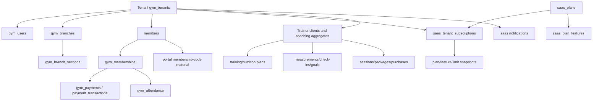

# 07 — Data and Domain Map

## Domain graph

## Aggregates and boundaries

| Aggregate | Main data/source | Scope rule | Mobile-safe identifier policy |
| --- | --- | --- | --- |
| Tenant | `dbo.gym_tenants` | tenant id + trusted session context | May display server-derived tenant id/slug; never use a client-supplied id as authority. |
| Staff | `dbo.gym_users`, sessions | user + tenant or platform scope | User id is opaque data; never infer role from id. |
| Branch/section | `gym_branches`, `gym_branch_sections`, access tables | tenant + branch + section | Send selected ids only after server bootstrap; server validates ownership/access. |
| Member | `members` and member services | tenant; selected branch/membership eligibility | Member id is an opaque server identifier. |
| Membership | membership tables/access tables | tenant/member/branch/section | Never synthesize membership or scope from local cache. |
| Finance | payments, transactions, refunds, expenses, ledger | tenant + validated branch scope | Amounts/calculations are server-owned. |
| Attendance | attendance/check-in/check-out | tenant + branch/section/member | Client sends intent/id; server validates current state. |
| Trainer | trainer client/coaching/session/package tables | independent trainer tenant + client | Client/session ids are opaque and tenant-checked. |
| SaaS | plans, feature rows, subscriptions, changes, overrides, proofs | platform or explicit tenant target | Effective envelope is derived; plan flags are not trusted from local storage. |
| Portal | membership code hash/ciphertext/audit, portal sessions | code owner/member/tenant | Raw membership code is secret-like; do not persist in general app storage. |
| Notifications | tenant notifications, user/member read rows | tenant + recipient/audience | IDs are opaque; read operations are scoped. |
| Files | object-storage metadata and private keys | tenant/category/actor | Mobile receives authorized download/upload contract, never bucket credentials. |

## RLS and SQL context

SQL requests decorated by `src/database/pool.js` set `SESSION_CONTEXT` keys for tenant id and mode. `database/migrations/013-phase0-security-preconditions.sql` and later security checks register tenant tables/RLS assumptions. Platform operations use platform mode and must specify target tenant. A mobile request must not send or override the SQL context; the server must derive it from the authenticated/session or portal identity.

## Historical and snapshot data

Subscription snapshots, financial rows, expired memberships, audit events, and portal-code audit records are historical facts. Mobile screens may display them according to the endpoint contract but must not rewrite or delete them as “cache cleanup.”

## Data not safe to persist casually

Passwords, session cookies/tokens, raw portal codes, payment proof bytes, private storage keys, audit-sensitive PII, and server secrets must remain in server/secure storage boundaries. See `13-SECURITY.md` and `14-DATA-CACHING-OFFLINE.md`.
